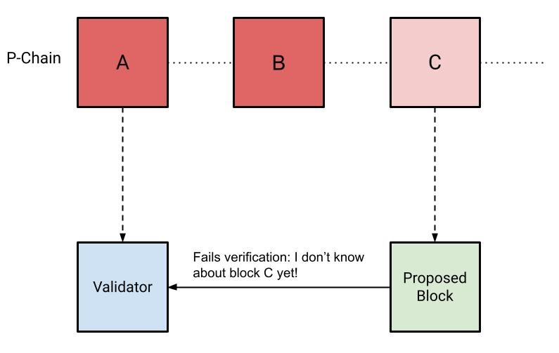
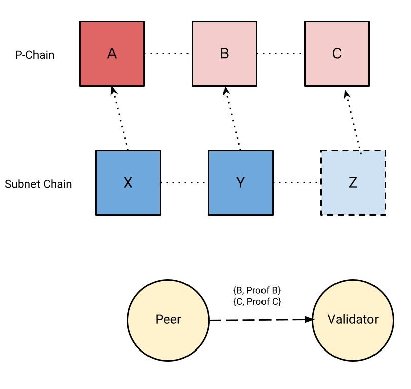
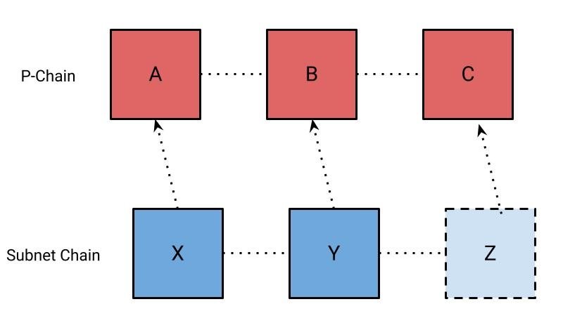

| ACP | 75 |
| :--- | :--- |
| **Title** | Acceptance Proofs |
| **Author(s)** | Joshua Kim |
| **Status** | Proposed ([Discussion](https://github.com/avalanche-foundation/ACPs/discussions/82)) |
| **Track** | Standards |

## Abstract

Introduces support for a proof of a block’s acceptance in consensus.

## Motivation

Subnets are able to prove arbitrary events using warp messaging, but native support for proving block acceptance at the protocol layer enables more utility. Acceptance proofs are introduced to prove that a block has been accepted by a subnet. One example use case for acceptance proofs is to provide stronger fault isolation guarantees from the primary network to subnets.

Subnets use the [ProposerVM](https://github.com/ava-labs/avalanchego/blob/416fbdf1f783c40f21e7009a9f06d192e69ba9b5/vms/proposervm/README.md) to implement soft leader election for block proposal. The ProposerVM determines the block producer schedule from a randomly shuffled validator set at a specified P-Chain block height. Validators are therefore required to have the P-Chain block referenced in a block's header to verify the block producer against the expected block producer schedule. If a block's header specifies a P-Chain height that has not been accepted yet, the block is treated as invalid. If a block referencing an unknown P-Chain height was produced virtuously, it is expected that the validator will eventually discover the block as its P-Chain height advances and accept the block.

If many validators disagree about the current tip of the P-Chain, it can lead to a liveness concern on the subnet where block production entirely stalls. In practice, this almost never occurs because nodes produce blocks with a lagging P-Chain height because it’s likely that most nodes will have accepted a sufficiently stale block. This however, relies on an assumption that validators are constantly making progress in consensus on the P-Chain to prevent the subnet from stalling. This leaves an open concern where the P-Chain stalling on a node would prevent it from verifying any blocks, leading to a subnet unable to produce blocks if many validators stalled at different P-Chain heights.

---

Figure 1: A Validator that has synced P-Chain blocks `A` and `B` fails verification of a block proposed at block `C`.



---

We introduce "acceptance proofs", so that a peer can verify any block accepted by consensus. In the aforementioned use-case, if a P-Chain block is unknown by a peer, it can request the block and proof at the provided height from a peer. If a block's proof is valid, the block can be executed to advance the local P-Chain and verify the proposed subnet block. Peers can request blocks from any peer without requiring consensus locally or communication with a validator. This has the added benefit of reducing the number of required connections and p2p message load served by P-Chain validators.

---

Figure 2: A Validator is verifying a subnet’s block `Z` which references an unknown P-Chain block `C` in its block header


Figure 3: A Validator requests the blocks and proofs for `B` and `C` from a peer



Figure 4: The Validator accepts the P-Chain blocks and is now able to verify `Z`



---

## Specification

Note: The following is pseudocode.

### P2P

#### Aggregation

```diff
+ message GetAcceptanceSignatureRequest {
+   bytes chain_id = 1;
+   uint32 request_id = 2;
+   bytes block_id = 3;
+ }
```

The `GetAcceptanceSignatureRequest` message is sent to a peer to request their signature for a given block id.

```diff
+ message GetAcceptanceSignatureResponse {
+   bytes chain_id = 1;
+   uint32 request_id = 2;
+   bytes bls_signature = 3;
+ }
```

`GetAcceptanceSignatureResponse` is sent to a peer as a response for `GetAcceptanceSignatureRequest`. `bls_signature` is the peer’s signature using their registered primary network BLS staking key over the requested `block_id`. An empty `bls_signature` field indicates that the block was not accepted yet.

## Security Considerations

Nodes that bootstrap using state sync may not have the entire history of the
P-Chain and therefore will not be able to provide the entire history for a block
that is referenced in a block that they propose. This would be needed to unblock a node that is attempting to fast-forward their P-Chain, as they require the entire ancestry between their current accepted tip and the block they are attempting to forward to. It is assumed that nodes will have some minimum amount of recent state so that the requester can eventually be unblocked by retrying, as only one node with the requested ancestry is required to unblock the requester.

An alternative is to make a churn assumption and validate the proposed block's proof with a stale validator set to avoid complexity, but this introduces more security concerns.

## Copyright

Copyright and related rights waived via [CC0](https://creativecommons.org/publicdomain/zero/1.0/).
