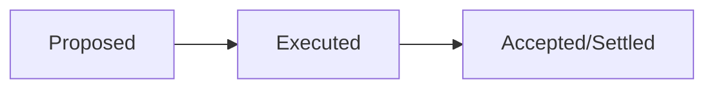
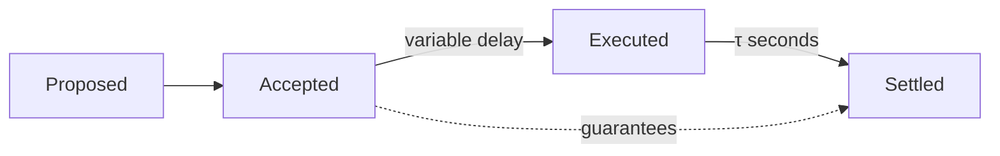

| ACP | 194 |
| :--- | :--- |
| **Title** | Streaming Asynchronous Execution |
| **Author(s)** | Arran Schlosberg ([@ARR4N](https://github.com/ARR4N)), Stephen Buttolph ([@StephenButtolph](https://github.com/StephenButtolph)) |
| **Status** | Proposed |
| **Track** | Standards |

## Abstract

Streaming Asynchronous Execution (SAE) decouples consensus and execution by introducing a queue upon which consensus is performed.
A concurrent execution stream is responsible for clearing the queue and reporting a delayed state root for recording by later rounds of consensus.
Validation of transactions to be pushed to the queue is lightweight but guarantees eventual execution.

## Motivation

### Performance improvements

1. Concurrent consensus and execution streams eliminate node context switching, reducing latency caused by each waiting on the other.
In particular, "VM time" (akin to CPU time) more closely aligns with wall time since it is no longer eroded by consensus.
This increases gas per wall-second even without an increase in gas per VM-second.
2. Lean, execution-only clients can rapidly execute the queue agreed upon by consensus, providing accelerated receipt issuance and state computation.
Without the need to compute state _roots_, such clients can eschew expensive Merkle data structures.
End users see expedited but identical transaction results.
3. Irregular stop-the-world events like database compaction are amortised over multiple blocks.
4. Introduces additional bursty throughput by eagerly accepting transactions, without a reduction in security guarantees.
5. Third-party accounting of non-data-dependent transactions, such as EOA-to-EOA transfers of value, can be performed prior to execution.

### Future features

Performing transaction execution after consensus sequencing allows the usage of consensus artifacts in execution. This unblocks some additional future improvements:

1. Exposing a real-time VRF during transaction execution.
2. Using an encrypted mempool to reduce front-running.

This ACP does not introduce these, but some form of asynchronous execution is required to correctly implement them.

### User stories

1. A sophisticated DeFi trader runs a highly optimised execution client, locally clearing the transaction queue well in advance of the network—setting the stage for HFT DeFi.
2. A custodial platform filters the queue for only those transactions sent to one of their EOAs, immediately crediting user balances.

## Description

In all execution models, a block is _proposed_ and then verified by validators before being _accepted_. To assess a block's validity in _synchronous_ execution, its transactions are first _executed_ and only then _accepted_ by consensus. This immediately and implicitly _settles_ all of the block's transactions by including their execution results at the time of _acceptance_.

Under SAE, a block is considered valid if all of its transactions can be paid for when eventually _executed_, after which the block is _accepted_ by consensus. The act of _acceptance_ enqueues the block to be _executed_ asynchronously. In the future, some as-yet-unknown later block will reference the execution results and _settle_ all transactions from the _executed_ block.

### Block lifecycle

#### Proposing blocks

The validator selection mechanism for block production is unchanged. However, block builders are no longer expected to execute transactions during block building.

The block builder is expected to include transactions by building upon the most recently settled state and to apply worst-case bounds on the execution of the ancestor blocks prior to the most recently settled block.

The worst-case bounds enforce minimum balances of sender accounts and the maximum required base fee. The worst-case bounds are described [below](#block-validity-and-building).

Prior to adding a proposed block to consensus, all validators MUST verify that the block builder correctly enforced the worst-case bounds while building the block. This guarantees that the block can be executed successfully if it is accepted.

> [!NOTE]
> The worst-case bounds guarantee does not provide assurance about whether or not a transaction will revert nor whether its computation will run out of gas by reaching the specified limit. The verification only ensures the transaction is capable of paying for the accrued fees.

#### Accepting blocks

Once a block is marked as accepted by consensus, the block is put in a FIFO execution queue.

#### Executing blocks

Each client runs a block executor in parallel, which constantly executes the blocks from the FIFO queue.

In addition to executing the blocks, the executor provides deterministic timestamps for the beginning and end of each block's execution.

Time is measured two ways by the block executor:

1. The timestamp included in the block header.
2. The amount of gas charged during the execution of blocks.

> [!NOTE]
> Execution timestamps are more granular than block header timestamps to allow sub-second block execution times.

As soon as there is a block available in the execution queue, the block executor starts processing the block.

If the executor's current timestamp is prior to the current block's timestamp, the executor's timestamp is advanced to match the block's.
Advancing the timestamp in this scenario results in unused gas capacity, reducing the gas _excess_ from which the price is determined.

The block is then executed on top of the last executed (not settled) state.

After executing the block, the executor advances its timestamp based on the gas usage of the block, also increasing the gas _excess_ for the pricing algorithm.

The block's execution time is now timestamped and the block is available to be settled.

#### Settling blocks

Already-executed blocks are settled once a following block that includes the results of the executed block is accepted.
The results are included by setting the state root to that of the last executed block and the receipt root to that of a MPT of all receipts since last settlement, possibly from more than one block.
The following block's timestamp is used to determine which blocks to settle—blocks are settled if said timestamp is greater than or equal to the execution time of the executed block plus a constant delay.

The additional delay amortises any sporadic slowdowns the block executor may have encountered.

## Specification

### Background

ACP-103 introduced the following variables for calculating the gas price:

| | |
|---|---|
| $T$ | the target gas consumed per second |
| $M$ | minimum gas price |
| $K$ | gas price update constant |
| $R$ | gas capacity added per second |

ACP-176 provided a mechanism to make $T$ dynamic and set:

$$
\begin{align}
R &= 2 \cdot T \\
K &= 87 \cdot T
\end{align}
$$

The _excess_ actual consumption $x \ge 0$ beyond the target $T$ is tracked via numerical integration and used to calculate the gas price as:

$$M \cdot \exp\left(\frac{x}{K}\right)$$

### Gas charged

We introduce $g_L$, $g_U$, and $g_C$ as the gas _limit_, _used_, and _charged_ per transaction, respectively. We define

$$
g_C := \max\left(g_U, \frac{g_L}{\lambda}\right)
$$

where $\lambda$ enforces a lower bound on the gas charged based on the gas limit.

> [!NOTE]
> $\dfrac{g_L}{\lambda}$ is rounded up by actually calculating $\dfrac{g_L + \lambda - 1}{\lambda}$

In all previous instances where execution referenced gas used, from now on, we will reference gas charged. For example, the gas excess $x$ will be modified by $g_C$ rather than $g_U$.

### Queue size

The constant time delay between block execution and settlement is defined as $\tau$ seconds.

The maximum allowed size of the execution queue is defined as:

$$
\omega ~:= R \cdot \tau \cdot \lambda
$$

Any block that could cause the total sum of gas limits for transactions in the execution queue to exceed $\omega$ MUST be considered invalid.

### Block executor

During the activation of SAE, the block executor's timestamp $t_e$ is initialised to the timestamp of the last accepted block.

Prior to executing a block with timestamp $t_b$, the executor's timestamp and excess is updated:

$$
\begin{align}
\Delta{t} &~:= \max\left(t_e, t_b\right) - t_e \\
t_e &~:= t_e + \Delta{t} \\
x &~:= \max\left(x - T \cdot \Delta{t}, 0\right) \\
\end{align}
$$

The block is then executed with the gas price calculated from the current value of $x$.

After executing a block that charged $g_C$ gas in total, the executor's timestamp and excess is updated:

$$
\begin{align}
\Delta{t} &~:= \frac{g_C}{R} \\
t_e &~:= t_e + \Delta{t} \\
x &~:= x + \Delta{t} \cdot (R - T) \\
\end{align}
$$

> [!NOTE]
> The update rule here assumes that $t_e$ is a timestamp that tracks the passage of time both by gas and by wall-clock time. $\frac{g_C}{R}$ MUST NOT be simply rounded. Rather, the gas accumulation MUST be left as a fraction.

$t_e$ is now this block's execution timestamp.

### Handling gas target changes

When a block is produced that modifies $T$, both the consensus thread and the execution thread will update to the modified $T$ after their own handling of the block.

For example, restrictions of the queue size MUST be calculated based on the parent block's $T$.

Similarly, the time spent executing a block MUST be calculated based on the parent block's $T$.

### Block settlement

For a _proposed_ block that includes timestamp $t_b$, all ancestors whose execution timestamp $t_e$ is $t_e \leq t_b - \tau$ are considered settled.
Note that $t_e$ is not an integer as it tracks fractional seconds with gas consumption, which is not the case for $t_b$.

The _proposed_ block MUST include the `stateRoot` produced by the execution of the most recently settled block.

For any _newly_ settled blocks, the _proposed_ block MUST include all execution artifacts:
- `receiptsRoot`
- `logsBloom`
- `gasUsed`

The receipts root MUST be computed as defined in [EIP-2718](https://eips.ethereum.org/EIPS/eip-2718) except that the tree MUST be built from the concatenation of receipts from all blocks being settled.

> [!NOTE]
> If the block executor has fallen behind, the node may not be able to determine precisely which ancestors should be considered settled. If this occurs, validators MUST allow the block executor to catch up prior to deciding the block's validity.

### Block validity and building

After determining which blocks to settle, all remaining ancestors of the new block must be inspected to determine the worst-case bounds on $x$ and account balances. Account nonces are able to be known immediately.

The worst-case bound on $x$ can be calculated by following the block executor update rules using $g_L$ rather than $g_C$.

The worst-case bound on account balances can be calculated by charging the worst-case gas cost to the sender of a transaction along with deducting the value of the transaction from the sender's account balance.

The `baseFeePerGas` field MUST be populated with the gas price based on the worst-case bound on $x$ at the start of block execution.

### Configuration Parameters

As noted above, SAE depends on the values of $\tau$ and $\lambda$ to be set as parameters and the value of $\omega$ is derived from $T$. 

Parameters to specify for the C-Chain are:

| Parameter | Description | C-Chain Configuration|
| - | - | - |
| $\tau$ | duration between execution and settlement | $5s$ |
| $\lambda$ | minimum conversion from gas limit to gas charged | $2$ |

## Backwards Compatibility

This ACP modifies the meaning of multiple fields in the block. A comprehensive list of changes will be produced once a reference implementation is available.

Likely fields to change include:
- `stateRoot`
- `receiptsRoot`
- `logsBloom`
- `gasUsed`
- `extraData`

## Reference Implementation

A reference implementation is still a work-in-progress. This ACP will be updated to include a reference implementation once one is available.

## Security Considerations

### Worst-case transaction validity

To avoid a DoS vulnerability on execution, we require an upper bound on transaction gas cost (i.e. amount $\times$ price) beyond the regular requirements for transaction validity (e.g. nonce, signature, etc.). We therefore introduced "worst-case cost" validity.

We can prove that if every transaction were to use its full gas limit this would result in the greatest possible:

1. Consumption of gas units (by definition of the gas limit); and
2. Gas excess $x$ (and therefore gas price) at the time of execution.

For a queue of blocks $Q = \\{i\\}_ {i \ge 0}$ the gas excess $x_j$ immediately prior to execution of block $j \in Q$ is a monotonic, non-decreasing function of the gas usage of all preceding blocks in the queue; i.e. $x_j~:=~f(\\{g_i\\}_{i<j})$.

To see this, consider block $0 \le k<j$ consuming gas $g_k$.
A decrease in $g_k$ reduces the immediate increase of $x$.
Furthermore, this lowered consumption might further reduce $x$ at the start of executing the next block if $t^k_e < t^{k+1}_b$ and therefore $\Delta t > 0$.
Hence any decrease of $x$ is $\ge$ predicted.
The excess, and hence gas price, for every later block $x_{i>k}$ is therefore reduced:

$$
\downarrow g_k \implies
\begin{cases}
    \downarrow \Delta^+x \propto g_k \\
    \uparrow \Delta^-x \propto R-g_k
\end{cases}
\implies \downarrow \Delta x_k
\implies \downarrow M \cdot \exp\left(\frac{x_{i>k}}{K}\right)
$$

Given maximal gas consumption under (1), the monotonicity of $f$ implies (2).

Since we are working with non-negative integers, it follows that multiplying a transaction's gas limit by the hypothetical gas price of (2) results in its worst-case gas cost.
Any sender able to pay for this upper bound (in addition to value transfers) is guaranteed to be able to pay for the actual execution cost.
Transaction _acceptance_ under worst-case cost validity is therefore a guarantee of _settlement_.

### Queue DoS protection

Worst-case cost validity only protects against DoS at the point of execution but leaves the queue vulnerable to high-limit, low-usage transactions.

For example, a malicious user could send a transfer-only transaction (21k gas) with a limit set to consume the block's full gas limit.

Although they would have to have sufficient funds to theoretically pay for all the reserved gas, they would never actually be charged this amount. Pushing a sufficient number of such transactions to the queue would artificially inflate the worst-case cost of other users.

Therefore, the gas charged was modified from being equal to the gas usage to the above $g_C := \max\left(g_U, \frac{g_L}{\lambda}\right)$

The gas limit is typically set higher than the predicted gas consumption to allow for a buffer should the prediction be imprecise.
This precludes setting $\lambda := 1$.
Conversely, setting $\lambda := \infty$ would allow users to attack the queue with high-limit, low-consumption transactions.

Setting $\lambda ~:= 2$ allows for a 100% buffer on gas-usage estimates without penalising the sender, while still disincentivising falsely high limits.

#### Upper bound on queue DoS

Recall $R$ (gas capacity per second) for rate and $g_C$ (gas charged) as already defined.

The actual gas excess $x_A$ has an upper bound of the worst-case excess $x_W$, both of which can be used to calculate respective base fees $f_A$ and $f_W$ (the variable element of gas prices) from the existing exponential function:

$$
f := M \cdot \exp\left( \frac{x}{K} \right).
$$

Mallory is attempting to maximize the DoS ratio

$$
D := \frac{f_W}{f_A}
$$

by maximizing $\Sigma_{\forall i} (g_L - g_U)_i$ to maximize $x_W - x_A$.

> [!TIP]
> Although $D$ shadows a variable in ACP-176, that one is very different to anything here so there won't be confusion.

Recall that the increasing excess occurs such that

$$
x := x + g \cdot \frac{(R - T)}{R}
$$

Since we limit the size of the queue to $\omega$, we can derive an upper bound on the difference in the changes to worst-case and actual gas excess caused by the transactions in the queue:

$$
\begin{align}
\Delta x_A &\ge \frac{\omega}{\lambda} \cdot \frac{(R - T)}{R} \\
\Delta x_W &= \omega \cdot \frac{(R - T)}{R} \\
\Delta x_W - \Delta x_A &\le \omega \cdot \frac{(R - T)}{R} - \frac{\omega}{\lambda} \cdot \frac{(R - T)}{R} \\
&= \omega \cdot \frac{(R - T)}{R} \cdot \left(1-\frac{1}{\lambda}\right) \\
&= \omega \cdot \frac{(2 \cdot T - T)}{2 \cdot T} \cdot \left(1-\frac{1}{\lambda}\right) \\
&= \frac{\omega}{2} \cdot \left(1-\frac{1}{\lambda}\right) \\
&= \frac{R \cdot \tau \cdot \lambda}{2} \cdot \left(1-\frac{1}{\lambda}\right) \\
&= \frac{R \cdot \tau}{2} \cdot (\lambda-1) \\
&= \frac{2 \cdot T \cdot \tau}{2} \cdot (\lambda-1) \\
&= T \cdot \tau \cdot (\lambda-1) \\
\end{align}
$$

Note that we can express Mallory's DoS quotient as:

$$
\begin{align}
D &= \frac{f_W}{f_A} \\
&= \frac{ M \cdot \exp \left( \frac{x_W}{K} \right)}{ M \cdot \exp \left( \frac{x_A}{K} \right)} \\
& = \exp \left( \frac{x_W - x_A}{K} \right).
\end{align}
$$

When the queue is empty (i.e. the execution stream has caught up with accepted transactions), the worst-case fee estimate $f_W$ is known to be the actual base fee $f_A$; i.e. $Q = \emptyset \implies D=1$. The previous bound on $\Delta x_W - \Delta x_A$ also bounds Mallory's ability such that:

$$
\begin{align}
D &\le \exp \left( \frac{T \cdot \tau \cdot (\lambda-1)}{K} \right)\\
&= \exp \left( \frac{T \cdot \tau \cdot (\lambda-1)}{87 \cdot T} \right)\\
&= \exp \left( \frac{\tau \cdot (\lambda-1)}{87} \right)\\
\end{align}
$$

Therefore, for the values suggested by this ACP:

$$
\begin{align}
D &\le \exp \left( \frac{5 \cdot (2 - 1)}{87} \right)\\
&= \exp \left( \frac{5}{87} \right)\\
&\simeq 1.06\\
\end{align}
$$

In summary, Mallory can require users to increase their gas price by at most ~6%. In practice, the gas price often fluctuates more than 6% on a regular basis. Therefore, this does not appear to be a significant attack vector.

However, any deviation that dislodges the gas price bidding mechanism from a true bidding mechanism is of note.

## Appendix

### JSON RPC methods

Although asynchronous execution decouples the transactions and receipts recorded by a specific block, APIs MUST NOT alter their behavior to mirror this.
In particular, the API method `eth_getBlockReceipts` MUST return the receipts corresponding to the block's transactions, not the receipts settled in the block.

#### Named blocks

The Ethereum Mainnet APIs allow for retrieving blocks by named parameters that the API server resolves based on their consensus mechanism.
Other than the _earliest_ (genesis) named block, which MUST be interpreted in the same manner, all other named blocks are mapped to SAE in terms of the _execution_ status of blocks and MUST be interpreted as follows:

 * _pending_: the most recently _accepted_ block;
 * _latest_: the block that was most recently _executed_;
 * _safe_ and _finalized_: the block that was most recently _settled_.

> [!NOTE]
> The finality guarantees of Snowman consensus remove any distinction between _safe_ and _finalized_. 
> Furthermore, the _latest_ block is not at risk of re-org, only of a negligible risk of data corruption local to the API node.

### Observations around transaction prioritisation

As EOA-to-EOA transfers of value are entirely guaranteed upon _acceptance_, block builders MAY choose to prioritise other transactions for earlier execution.

A reliable marker of such transactions is a gas limit of 21,000 as this is an indication from the sender that they do not intend to execute bytecode.

However, this could delay the ability to issue transactions that depend on these EOA-to-EOA transfers.

Block builders are free to make their own decisions around which transactions to include.

## Acknowledgments

Thank you to the following non-exhaustive list of individuals for input, discussion, and feedback on this ACP.

* [Aaron Buchwald](https://github.com/aaronbuchwald)
* [Angharad Thomas](https://x.com/divergenceharri)
* [Meaghan FitzGerald](https://github.com/meaghanfitzgerald)
* [Michael Kaplan](https://github.com/michaelkaplan13)
* [Yacov Manevich](https://github.com/yacovm)

## Copyright

Copyright and related rights waived via [CC0](https://creativecommons.org/publicdomain/zero/1.0/).
