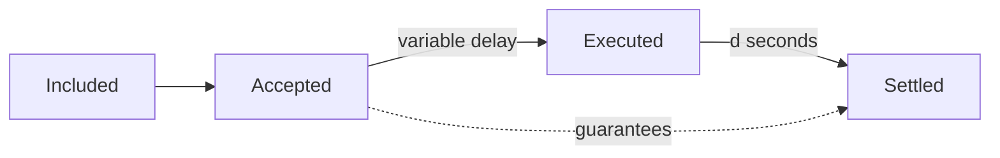
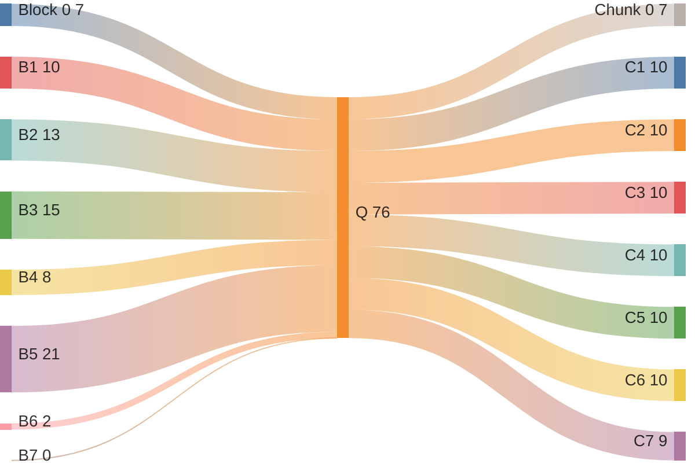

| ACP | 194 |
| :--- | :--- |
| **Title** | Streaming Asynchronous Execution |
| **Author(s)** | Arran Schlosberg ([@ARR4N](https://github.com/ARR4N)), Stephen Buttolph ([@StephenButtolph](https://github.com/StephenButtolph)) |
| **Status** | Proposed, Implementable, Activated, Stale ([Discussion](POPULATED BY MAINTAINER, DO NOT SET)) |
| **Track** | Standards |

## Abstract

Streaming Asynchronous Execution (SAE) decouples consensus and execution by introducing a (theoretically unbounded) transaction queue upon which consensus is performed.
A concurrent execution stream is responsible for clearing the queue and reporting a delayed state root for recording by later rounds of consensus.
Validation of transactions to be pushed to the queue is lightweight but guarantees eventual execution.

## Motivation

### Performance improvements

1. Concurrent consensus and execution streams eliminate node context switching, reducing latency caused by each waiting on the other.
In particular, "VM time" (akin to CPU time) more closely aligns with wall time since it is no longer eroded by consensus.
This increases gas per wall-second even without an increase in gas per VM-second.
2.  Lean, execution-only clients can rapidly execute the queue agreed upon by consensus, providing accelerated receipt issuance and state computation.
Without the need to compute state _roots_, such clients can eschew expensive Merkle data structures.
End users see expedited but identical transaction results.
3. Irregular stop-the-world events like database compaction are amortised over multiple blocks.
4. EOA-to-EOA transfers of value can be considered settled immediately upon being pushed to the queue by consensus.
5. Introduces bursty throughput under temporary high load, preemptively accepting transactions that may take marginally longer to execute, without a reduction in security guarantees.

### User stories

1. A sophisticated DeFi trader runs a highly optimised execution client, locally clearing the transaction queue well in advance of the network—setting the stage for HFT DeFi.
2. A custodial platform filters the queue for only those transactions sent to one of their EOAs, immediately crediting user balances.

## Specification

### Transaction queue

#### Pushing transactions

Standard, synchronous execution couples a block to the ordered set of transactions to be executed in said block.
Let there instead be a FIFO queue of all known, valid transactions—the specifics of "validity" will be addressed later.
Under SAE, a block's ordered transactions instead constitute those to be pushed to the queue
A transaction is said to be _included_ when a block builder adds it to a block and _accepted_ once consensus, performed over blocks, agrees to add it to the queue.
We refer to the ordered set of enqueued transactions as a _tranche_.

#### Clearing the queue

For a block indexed by its height $B$, let its timestamp be $t_B$, measured at per-second resolution.
We now introduce the concept of a _chunk_ of executed transactions, indexed by its timestamp $t_C$, at the same resolution.
Whereas proposers _build_ blocks, execution is said to _fill_ chunks and a chunk is considered full when the first of two criteria is met:

1. The queue accepted by time $t_C$ is exhausted; i.e. the queue as at the last block with a timestamp $t_B \le t_C$; or
2. The chunk's remaining gas limit is insufficient for the next transaction in the queue.

As there is one chunk per second, the gas limit is simply the gas capacity added per second, $R$, of ACPs 103 and 176.

A chunk that is filled under criterion (2) may have leftover capacity due to imperfect packing and MUST _donate_ this residual capacity to the next chunk to allow for full utilisation of the chain's gas throughput.
 This is not to say that execution of the queue should be paused until the next second, but that the transaction's allocated chunk may well be in the future.
For clarification, see the [alternative framing of chunk filling](#alternative-framing-of-chunk-filling).

> [!NOTE]
> A side effect of chunk donation and when it is invoked is that transactions using more than a single chunk of gas MAY induce empty _interim_ chunks.

> [!WARNING]
> A chunk filled due to queue exhaustion MUST NOT donate remaining capacity as this would result in excess load since the next known transaction won't be available for immediate execution.

A completed chunk is comprised of (a) the updated state root; and (b) the set of receipts for transactions executed in the chunk.
In addition to interim chunks, a chunk MAY also be empty if the queue was exhausted by the previous chunk and no block was agreed on by the next second.
An empty chunk, by definition, has an empty set of receipts and the same state root as its predecessor.

#### Recording state

A block with timestamp $t_B$ MUST record the post-execution state root with a delay of exactly $d$ seconds, i.e. that which was determined by the (possibly empty) chunk at time $t_C = t_B - d$.
Similarly, it MUST record the transaction-receipt root for all transactions executed as part of chunks in the half-open range $t_C \in (t_{B-1} - d, t_B - d]$.
It is at this point that a transaction is said to be _settled_ on the blockchain.

#### Terminology recap

In summary, a transaction is _included_ when added to a _built_ block.
It is later _accepted_ after consensus agrees upon the block in which it was included, enqueuing the transaction (as part of the block's _tranche_) for later _execution_ in a chunk.
The chunk is _full_ when it exhausts either the queue or its gas limit, and the transaction is _settled_ when its receipt is part of a later block agreed upon by consensus.
While the delay between execution and settlement is always $d$ seconds, the time between acceptance and execution is variable.
Note, however, that the validity checks we now describe mean that acceptance is a guarantee of eventual settlement in a deterministic but as yet unknown block.

> [!NOTE]
> The guarantee provides no assurance about whether or not a transaction will revert nor whether its computation will run out of gas by reaching the specified limit.
> However, this is not a concern for EOA-to-EOA transfers of value so such transactions are guaranteed in totality.

### Updating gas price

ACP-103 introduced the following variables for calculating the gas price:

| | |
|---|---|
| $T$ | the target gas consumed per second |
| $M$ | minimum gas price |
| $K$ | gas price update constant |
| $R$ | gas capacity added per second |

ACP-176 set $R = 2T$ and provided a mechanism to make $T$ dynamic.
The _excess_ actual consumption $x \ge 0$ beyond the target $T$ is tracked via numerical integration and used to calculate the gas price as:

$$M \cdot \exp\left(\frac{x}{K}\right)$$

While ACPs 103 and 176 compute this price at the resolution of a single block, we can instead integrate at the resolution of a single transaction with equivalent pricing dynamics.
Exploiting the proportionality of $R = pT$ with $p \ge 1$, for a transaction consuming $g$ gas, the excess is increased:

$$x := x + \frac{g \cdot (p-1)}{p}$$

and the gas price is updated immediately after execution, according to the same formula.
When the transaction queue is drained and a chunk has a gas _surplus_ of $0 \le s \le R$, the excess is decreased:

$$x := \max\left(x-\frac{s}{p}, 0\right)$$

and the gas price is updated before the next chunk.
With the current $p = 2$, half of all gas consumed is added to excess while half of all surplus is deducted.

> [!NOTE]
> The ACP-103 concept of a leaky gas bucket with capacity $C$ is an emergent phenomenon in SAE.

### JSON RPC methods

Although asynchronous execution decouples the transactions and receipts recorded by a specific block, APIs MUST NOT alter their behavior to mirror this.
In particular, the API method `eth_getBlockReceipts` MUST return the receipts corresponding to the block's transactions, not the receipts settled in the block.

To achieve this, we first define the _executed_ and _settled_ states for blocks.
A block is initially _accepted_ by consensus, enqueing its tranche of transactions.
Once the last transaction in the tranche has been executed, the block itself is considered to be executed.
When the same transaction is settled then so too is the block considered settled.

#### Named blocks

The Ethereum Mainnet APIs allow for retrieving blocks by named parameters that the API server resolves based on their consensus mechanism.
Other than the _earliest_ (genesis) named block, which MUST be interpreted in the same manner, all other named blocks are mapped to SAE in terms of the execution status of all block transactions and MUST be interpreted as follows:

 * _pending_: the most recently _accepted_ block;
 * _latest_: the block that was most recently _executed_;
 * _safe_ and _finalized_: the block that was most recently _settled_.

> [!NOTE]
> The finality guarantees of Snowman consensus remove any distinction between _safe_ and _finalized_. 
> Furthermore, the _latest_ block is not at risk of re-org, only of a negligible risk of data corruption local to the API node.

### Optimal block building

As EOA-to-EOA transfers of value are entirely guaranteed upon _acceptance_, block builders SHOULD prioritise other transactions for earlier execution.
A reliable marker of such transactions is a gas limit of 21,000 as this is an indication from the sender that they do not intend to execute bytecode.

Checking for code at the destination address is both unnecessary and unreliable as the address might be that of a contract created earlier in the queue.

## Backwards Compatibility

All ACPs that introduce backwards incompatibilities must include a section describing these incompatibilities and their severity. The ACP should provide recommendations for dealing with these incompatibilities.

## Reference Implementation

A reference/example implementation that people can use to assist in understanding or implementing this specification. If the implementation is too large to reasonably be included inline, then consider adding it to the ACP subdirectory or linking to a PR in an external repository.

## Security Considerations

### Worst-case transaction validity

To avoid a DoS vulnerability on execution, we require an upper bound on transaction gas cost (i.e. amount $\times$ price).
Beyond regular requirements for transaction validity (e.g. nonce, signature, etc.) we therefore introduce "worst-case cost" validity.

Consider a hypothetical situation in which all enqueued transactions use their entire gas limit during execution.
We can prove that, for every transaction, this would result in the greatest possible:

1. Consumption of gas units (by definition of the gas limit); and
2. Gas excess $x$ (and therefore gas price) at the time of execution.

For a queue of transactions $Q = \\{i\\}_ {i \ge 0}$ the gas excess $x_j$ immediately prior to execution of transaction $j \in Q$ is a monotonic, non-decreasing function of the gas usage of all preceding transactions in the queue; i.e. $x_j~:=~f(\\{g_i\\}_{i<j})$.

To see this, consider transaction $0 \le k<j$ consuming gas $g_k$.
A decrease in $g_k$ reduces the immediate increase of $x$.
Furthermore, this lowered consumption can never reduce a chunk's gas surplus and hence any decrease of $x$ is $\ge$ predicted.
The excess, and hence gas price, for every later transaction $x_{i>k}$ is therefore reduced:

$$
\downarrow g_k \implies
\begin{cases}
    \downarrow \frac{g \cdot (p-1)}{p} \\
    \uparrow \frac{s}{p}
\end{cases}
\implies \downarrow \Delta x_k
\implies \downarrow M \cdot \exp\left(\frac{x_{i>k}}{K}\right)
$$

Given maximal gas consumption under (1), the monotonicity of $f$ implies (2).

Since we are working with non-negative integers, it follows that multiplying a transaction's gas limit by the hypothetical gas price of (2) results in its worst-case gas cost.
Any sender able to pay for this upper bound (in addition to value transfers) is guaranteed to be able to pay for the actual execution cost.
Transaction _acceptance_ under worst-case cost validity is therefore a guarantee of _settlement_.

### Queue DoS protection

Worst-case cost validity only protects against DoS at the point of execution but leaves the queue vulnerable to high-limit, low-usage transactions.
For example, a malicious user could send a transfer-only transaction (21k gas) with a limit set to multiple chunks.
Although they would have to have sufficient funds to theoretically pay for all the chunks, they would never actually be charged this amount. Pushing a sufficient number of such transactions to the queue would artificially inflate the worst-case cost of other users.

Gas limits are typically set higher than expected gas used to allow for a buffer should gas estimates be imprecise.
A lower bound of 50% of the specified limit, for example, would allow for a 100% buffer on estimates without penalising the sender, while still disincentivising falsely high limits.

#### Upper bound on queue DoS

With $R$ (for rate) as already defined (gas capacity per second), we introduce $g_L$, $g_U$, and $g_C$ as gas _limit_, _used_ and _charged_ per transaction, respectively, and

$$
g_C := \max(g_U, \lambda \cdot g_L)
$$

where $\lambda$ enforces a lower bound on the charge.

The actual gas excess $x_A$ has an upper bound of the worst-case excess $x_W$, both of which can be used  to calculate respective base fees $f_A$ and $f_W$ (the variable element of gas prices) from the existing exponential function:

$$
f := M \cdot \exp\left( \frac{x}{K} \right).
$$

Mallory is attempting to maximize the DoS ratio

$$
D := \frac{f_W}{f_A}
$$

by maximizing $\Sigma_{\forall i} (g_L - g_U)_i$ to maximize $x_W - x_A$.

> [!TIP]
> Although $D$ shadows a variable in ACP-176, that one is very different to anything here so there won't be confusion.

Recall that the proportionality $p$ of capacity per second and target gas per second ($R = pT$) results in increasing excess such that

$$
x := x + \frac{g (p-1)}{p}.
$$

If we allow the queue to have a bandwidth of $R\lambda^{-1}$ gas/second and limit its length $\tau$ seconds or a back-pressure window of $\omega = \tau R \lambda^{-1}$ gas, we can derive an upper bound on the difference in the changes to worst-case and actual gas excess:

$$
\begin{align}
\Delta x_A &\ge \lambda \cdot \omega \cdot \frac{p-1}{p} \\
\Delta x_W &= \omega \cdot \frac{p-1}{p} \\
\Delta x_W - \Delta x_A &\le (1-\lambda) \cdot \omega \cdot \frac{p-1}{p} \\
&= (1-\lambda) \cdot \frac{\tau R}{\lambda} \cdot \frac{p-1}{p} \\
&= \frac{1-\lambda}{\lambda} \cdot \tau \cdot p T \cdot \frac{p-1}{p} \\
&= \frac{1-\lambda}{\lambda} \cdot \tau \cdot T \cdot (p-1).
\end{align}
$$

Note that we can express Mallory's DoS quotient as:

$$
\begin{align}
D &= \frac{f_W}{f_A} \\
&= \frac{ M \cdot \exp \left( \frac{x_W}{K} \right)}{ M \cdot \exp \left( \frac{x_A}{K} \right)} \\
& = \exp \left( \frac{x_W - x_A}{K} \right).
\end{align}
$$

When the queue is empty (i.e. the execution stream has caught up with accepted transactions), the worst-case fee estimate $f_W$ is known to be the actual base fee $f_A$; i.e. $Q = \emptyset \implies D=1$. The previous bound on $\Delta x_W - \Delta x_A$ also bounds Mallory's ability such that:

$$
D \le \exp \left( \frac{\frac{1-\lambda}{\lambda} \cdot \tau \cdot T \cdot (p-1)}{K} \right).
$$

## Appendix

### Alternative framing of chunk filling

The criteria for chunk filling define an online algorithm that is equivalent to this offline perspective.

Consider a queue for which actual gas consumption is known for all transactions, and said consumption exceeds the chain capacity so the queue is never exhausted.
Filling can now be viewed as an allocation problem, selecting a deterministic chunk for each transaction.
As each round of consensus is required to record a specific chunk, no theoretical chunk can end earlier than any of its assigned transactions.
A transaction is therefore allocated to the theoretical chunk during which its execution completes.

> [!TIP]
> As chunk capacity is measured in terms of a gas _rate_, time and gas can be thought of interchangeably along the x-axis.
> Chunks are 1-indexed to reflect the time at which they end.

```mermaid
---
displayMode: compact
---
gantt
    title Theoretical chunks
    dateFormat  x
    axisFormat %S
    tickInterval 1second
    section Chunks
    c1  :c1, 0, 1s
    c2  :c2, after c1, 1s
    c3  :c3, after c2, 1s
    c4  :c4, after c3, 1s
    c5  :c5, after c4, 1s
    c6  :c6, after c5, 1s
    section Transactions
    t0  :t0, 0, 0.4s
    t1  :t1, after t0, 0.4s
    t2  :t2, after t1, 0.4s
    t3  :t3, after t2, 0.8s
    t4  :t4, after t3, 0.9s
    t5  :t5, after t4, 2s
    t6  :t6, after t5, 1.1s
    section Donations
    c1->c2  : 800, 0.2s
    c3->c4  : 2900, 0.1s
    c4->c5  : 2900, 1.1s
    c5->c6  : 4900, 0.1s
```

1. Total gas used by transactions `t0` and `t1` is less than a single chunk so they are allocated to `c1`.
2. Addition of `t2` would exceed `c1` capacity so it is instead allocated to `c2`.
3. Note the necessary "donation" of `c1`'s residual capacity to `c2`, allowing for allocation of `t3` as well.
4. Transaction `t4` is the only one that can fit into chunk `c3`.
5. The large transaction `t5` requires more than a single chunk of gas, resulting in `c4` being an empty _interim_ chunk and the allocation of `t5` to `c5`.
    1. The residual of `c3` was first donated to `c4`, which was unable to fit the next transaction, resulting in transitive donation to `c5`.
6. Even with its double donation, `c5` no longer has sufficient capacity for the final transaction `t6`, which is in `c6`.

Note that the donation-adjusted chunks fully utilise chain capacity while also completing execution no later than their respective timestamps, which would otherwise be detrimental to consensus.

```mermaid
---
displayMode: compact
---
gantt
    title Donation-adjusted chunks
    dateFormat x
    axisFormat %S
    tickInterval 1second
    section Chunks
    c1  :a1, 0, 0.8s
    c2  :a2, after a1, 1.2s
    c3  :a3, after a2, 0.9s
    c5  :a5, after a3, 2s
    c6  :a6, after a5, 1.1s
    section Transactions
    t0  :t0, 0, 0.4s
    t1  :t1, after t0, 0.4s
    t2  :t2, after t1, 0.4s
    t3  :t3, after t2, 0.8s
    t4  :t4, after t3, 0.9s
    t5  :t5, after t4, 2s
    t6  :t6, after t5, 1.1s
```

### Streaming vs regular asynchronous pipelining

## Acknowledgments

Thank you to the following non-exhaustive list of individuals for input, discussion, and feedback on this ACP.

* [Aaron Buchwald](https://github.com/aaronbuchwald)
* [Angharad Thomas](https://x.com/divergenceharri)
* [Meaghan FitzGerald](https://github.com/meaghanfitzgerald)
* [Michael Kaplan](https://github.com/michaelkaplan13)
* [Yacov Manevich](https://github.com/yacovm)

## Copyright

Copyright and related rights waived via [CC0](https://creativecommons.org/publicdomain/zero/1.0/).
