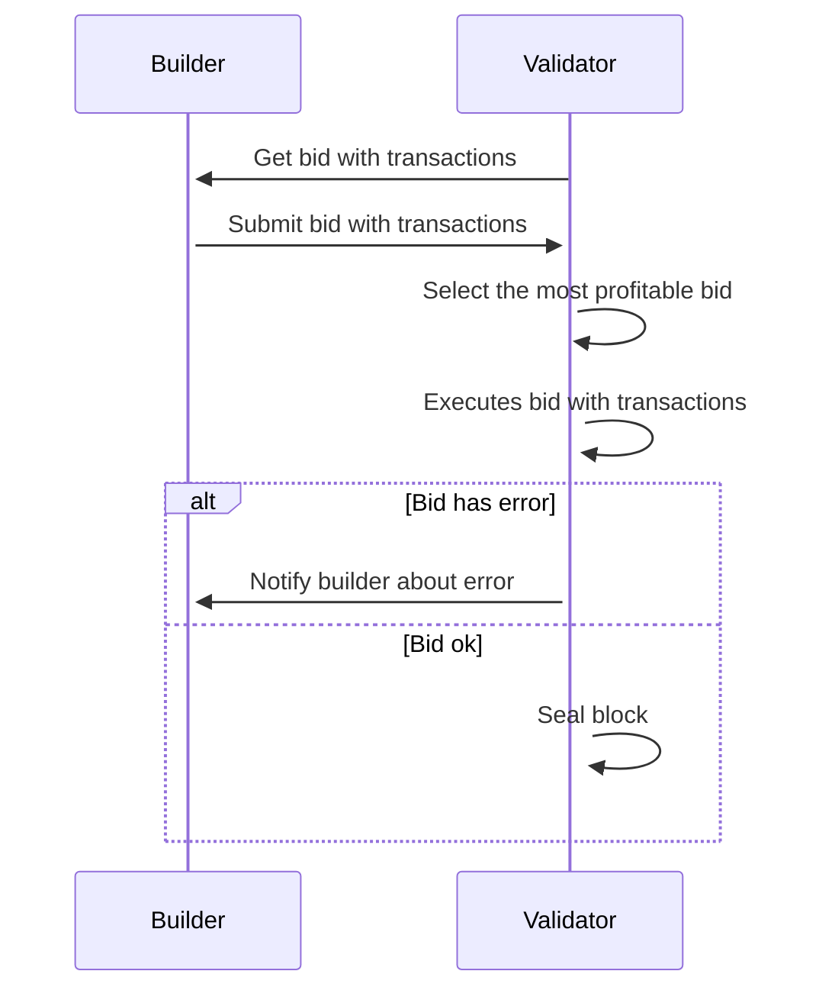

| ACP           | 208                                                                       |
| :------------ | :------------------------------------------------------------------------ |
| **Title**     | MEV Zone as Canonical MEV Infrastructure in AvalancheGo                   |
| **Author(s)** | [0x7183](http://github.com/0x7183) [toran777](http://github.com/toran777) |
| **Status**    |                                                                           |
| **Track**     | Best Practices                                                            |

## Abstract

This ACP introduces MEV Zone, a standard interface for managing Maximal Extractable Value (MEV) on Avalanche. It enables private transactions, protects users from frontrunning, and introduces sealed-bid auctions where searchers compete fairly. A portion of generated value is redistributed to the Avalanche community: validators receive MEV rewards and users benefit from private transactions and $AVAX burning.

## Motivation

#### Intro

Every year, over $3.5 million is generated through MEV on Avalanche, with little to no competition. None of this value currently flows back to the chain. As Avalanche continues to grow, this number is expected to rise significantly.

#### Core

- **Secure, zero-risk standard for validators**  
  Validators should face no downtime or performance penalties.

- **Implemented as an AvalancheGo dependency**  
  The solution lives in a library imported by AvalancheGo rather than inside the node itself, keeping the repository untouched.

- **Unified interface for searchers**  
  A single API for submitting MEV bundles eliminates the need for multiple implementations.

- **Simplified development for searchers and block builders**  
  One common interface reduces integration effort and resources.

- **Maintained solution**  
  Validators running custom MEV-enabled clients can adopt this implementation directly, which is also maintained by the node core developers, instead of running a third part implementation.

#### Required Changes

- Integrate MEV Zone into the [coreth library](https://github.com/ava-labs/coreth).

All updates are limited to Coreth, a dependency of AvalancheGo, so the node’s own repository remains completely untouched. This isolation eliminates the risk of conflicts with ongoing work on the core node.

Integrating MEV Zone directly into the library means that every validator running the official AvalancheGo node software will have MEV Zone functionality available but disabled by default. Validators can choose to activate it by updating their configuration file.

Since this library is maintained by the core team, any changes should go through the same process as the rest of the code.

## Description

This implementation doesn't follow Ethereum’s PBS design.  
Mev Zone's goal is to extend the validator’s functionality: receive blocks from block builders, check them, and, if they pass a set of predefined rules (see more below), add them to the chain.

We chose this approach primarily because Avalanche’s rapid block time (≈ 1.7 s at the time of this proposal) benefits from a low-latency solution.

Introducing an external relay would add unnecessary delay to the process. The proposed adjustment, however, keeps intact the security and trust assumptions that underlie the MEV market between builders and validators.

## Specification

Below are the specifications on what Mev Zone brings to the validator.

### Definitions

**Builder:** The party that gathers transaction bundles from searchers, packs them into the most profitable block it can and bids the validator to add that block to the chain in return for a fee.

**Validator (Proposer):** The node that signs and pushes a new block on chain. It reviews bids from builders, picks the best-paying block, and broadcasts it to the network.

**Searcher:** Watches the mempool for profit chances (like arbitrage or liquidations), packs the right transactions into a bundle, and sends it to a builder for the next block.

**Bid:** A builder’s offer for block space. A bid should include the following fields:

- **blockNumber** – height of the block
- **parentHash** – hash of the parent block
- **txs** – transactions to include in the bid
- **unRevertible** – tx hashes that must not be reverted (optional)
- **gasUsed** – total gas the block will consume
- **gasFee** – total gas fee that was burned
- **mevRewards** – total MEV captured in the block
- **mevBurnShare** – portion of MEV that will be burned
- **mevValidatorShare** – portion of MEV paid to the validator

- **packedBlockReward** – the total gas fees that the block builder's block would send to the coinbase address.

- **packedValidatorReward** – the validator’s payout.  
  We take the validator's wallet balance after the bid, subtract what it held beforehand, and the difference is the reward.

- **packedBurnShare** – the total mev share sent to the burn address.  
  We do the same delta calculation on the network’s burn address: balance after execution minus balance before.

- **currentBurn** – the total gas fees that the validator’s self-built block would send to the coinbase address.

### Bid acceptance rules

A bid is kept only if it passes **all** the checks below:

1. **Gas safety**

   - `gasUsed` in the bid must be **≤ the block gas limit** once the built-in gas reserves for the pay-bid and burn txs are deducted.

2. **Transaction validity**

   - Every tx in `txs` must execute without error.
   - Any hash listed in `unRevertible` must stay in the final block.

3. **Price floor**

   - For txs that are _not_ already in the mempool, the **average gas price** must be **≥ `minGasPrice`**.

4. **Reward correctness**

   - The builder reward, validator reward, and burn share must match the numbers declared in the bid (`mevRewards`, `mevValidatorShare`, `mevBurnShare`).
   - Both the **burnTx** and **payBidTx** must execute successfully.

5. **Burn-share correctness**

   - The balance increase at the burn address, **packedBurnShare**, must equal `mevBurnShare`.

6. **Block size**

   - The total encoded size of all bid-txs must stay **≤ `targetTxsSize`**.

7. **Outbid every other builder**

   - For the same parent hash, the bid’s **packedBlockReward** must be **no smaller** than any competing bid.

8. **Be more profitable than the validator’s own block**
   - The validator compares
     - `packedBlockReward + packedValidatorReward` **vs.** `currentBurn` (what its fallback block would earn).
   - The bid wins only if it pays **more** than the fallback.

If any of these checks fail, the validator drops the bid and reverts to its own block.

### Implementation

In our setup, builders and validators work together in a single step: during each block interval, the builder sends a bid that already contains the full list of transactions. The validator can then seal and publish the block right away.


- The next proposer asks the builder its bid with transactions transactions 
- The builder sends its bid with transactions to the next proposer.
- When the validator is the proposer, it picks the bid worth the most if it has any.
- The validator runs every transaction to make sure the set of rules match what the bid promised.
- If the bid is wrong, the validator falls back to the block it built earlier and tells the builder what went wrong.
- Once it has a valid bid, or uses its own block, the validator seals and broadcasts the block.

## Appendix

#### JSON-RPC APIs & Configuration

This part describes how builders interact with a validator that has **MEV functionality** enabled and how a validator can configure that functionality.

### 1. JSON-RPC Endpoints

#### 1.1 mev_sendBid

Submit a MEV bid to the validator.

```jsonc
{
  "jsonrpc": "2.0",
  "id": 1,
  "method": "mev_sendBid",
  "params": [
    {
      "rawBid": {
        "blockNumber": <uint>,               // Target block height
        "parentHash": "<parent_block_hash>", // Hash of the parent block
        "txs": [ "<raw_signed_tx>", ... ],   // Raw transactions included in the bid
        "unRevertible": [ "<tx_hash>", ... ],// (Optional) Tx hashes that MUST NOT fail
        "gasUsed": <uint>,                   // Gas consumed by the block
        "gasFee": "<wei>",                   // How much gas gets sent to the coinbase address
        "mevRewards": "<wei>",               // Total MEV extracted by builder
        "mevBurnShare": "<wei>",             // Portion of MEV burned
        "mevValidatorShare": "<wei>"         // Portion of MEV paid to validator
      },
      "signature": "<builder_signature>",     // ECDSA-sign over rawBid
      "payBidTx": "<raw_signed_tx>",          // Tx that transfers mevRewards to validator
      "payBidTxGasUsed": <uint>,              // Gas used by payBidTx
      "burnTx": "<raw_signed_tx>"             // Tx that burns mevBurnShare
    }
  ]
}
```

#### Response

```jsonc
{
  "jsonrpc": "2.0",
  "id": 1,
  "result": "<bid_hash>" // Hash of the accepted bid
}
```

#### 1.2 mev_params

Query the MEV info of the validator

```
{
    "jsonrpc": "2.0",
    "id": 1,
    "method": "mev_params"
}
```

#### Response

```jsonc
{
  "jsonrpc": "2.0",
  "id": 1,
  "result": {
    "ValidatorCommission": <bps>,        // Commission in basis points (1 bp = 0.01 %)
    "ValidatorWallet": "<address>",      // Address receiving the validator share
    "Version": "<validator_version>"     // Validator software version
  }
}

```

### 2. Validator Configuration

MEV functionality is **disabled by default**.  
To enable it, validators need edit the chain-config file following the official configuration (see the [official docs](https://build.avax.network/docs/nodes/chain-configs)):

```jsonc
{
  "eth-apis": [
    "internal-mev"        // Expose MEV-specific RPC endpoints
  ],

  "mev": {
    "enabled": true,       // Switch for the MEV module

    "builders": [          // List of trusted builders
      {
        "address": "<builder_address>",  // EOAs allowed to submit bids
        "url": "<builder_rpc_url>"       // Builder RPC endpoint to send notifications
      }
    ],

    "validatorCommission": <bps>,        // Commission in basis points (e.g. 500 = 5 %)
    "validatorWallet": "<validator_wallet_address>" // Validator reward address
  }
}
```

### Field Reference

| Field                     | Description                                                                                     |
| ------------------------- | ----------------------------------------------------------------------------------------------- |
| `eth-apis`                | Extra API namespaces exposed by the node. Must include `internal-mev` for any MEV RPCs to work. |
| `mev.enabled`             | Global on/off toggle for the MEV module.                                                        |
| `mev.builders[].address`  | EOA of an authorized builder. Only these addresses can call `mev_sendBid`.                      |
| `mev.builders[].url`      | Builder’s public RPC endpoint .                                                                 |
| `mev.validatorCommission` | Validator commission expressed in basis points (1 bp = 0.01 %).                                 |
| `mev.validatorWallet`     | Address that receives the validator’s commission share.                                         |

### 3. Reference Go Types

This is the **common interface** that every block-builder must implement if they want to interact with Avalanche validators.

### 3.1 RawBid

Represents the **canonical bid payload** sent from a builder to the validator.

```go
type RawBid struct {
    BlockNumber       uint64         `json:"blockNumber"`        // Target block height
    ParentHash        common.Hash    `json:"parentHash"`         // Hash of the parent block
    Txs               []hexutil.Bytes`json:"txs"`                // Raw signed txs to include
    UnRevertible      []common.Hash  `json:"unRevertible"`       // (Optional) tx hashes that must not fail
    GasUsed           uint64         `json:"gasUsed"`            // Gas consumed by the block
    GasFee            *big.Int       `json:"gasFee"`             // Total gas fee burned
    MevRewards        *big.Int       `json:"mevRewards"`         // Total MEV captured
    MevBurnShare      *big.Int       `json:"mevBurnShare"`       // Portion of MEV burned
    MevValidatorShare *big.Int       `json:"mevValidatorShare"`  // Portion of MEV paid to validator

    hash atomic.Value // Lazily-cached hash of the bid
}
```

### 3.2 BidArgs

Wrapper that carries a signed RawBid plus the auxiliary transactions used to pay rewards and burn fees.

```go
type BidArgs struct {
    RawBid          *RawBid      `json:"rawBid"`          // Embedded RawBid
    Signature       hexutil.Bytes`json:"signature"`       // Builder’s ECDSA signature over RawBid
    PayBidTx        hexutil.Bytes`json:"payBidTx"`        // Tx that transfers mevRewards to validator
    PayBidTxGasUsed uint64       `json:"payBidTxGasUsed"` // Gas used by payBidTx
    BurnTx          hexutil.Bytes`json:"burnTx"`          // Tx that transfers mevBurnShare to burn addr
}

```

## Backwards Compatibility

The implementation of this proposal will not introduce any backwards compatibility issues. It extends functionality for those who want to participate without impacting those who don’t.

## Security Considerations

MEV Zone integrates with AvalancheGo through minimal, isolated modifications that do not affect core consensus or block production. Validators remain fully functional regardless of MEV Zone status. If builders fail or behave incorrectly, validators default to standard block construction using internal logic.

## External Resources

- [Mev Explorer](https://explorer.mev.zone)
- [Documentation](https://mevzone.gitbook.io/mevzone)


