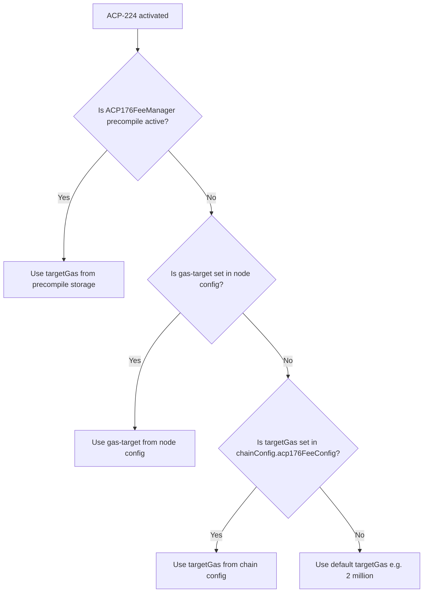

| ACP | PR Number |
| :--- | :--- |
| **Title** | Introduce ACP-176-Based Dynamic Gas Limits and Fee Manager Precompile in Subnet-EVM  |
| **Author(s)** |Ceyhun Onur ([@ceyonur](https://github.com/ceyonur)), Michael Kaplan ([@michaelkaplan13](https://github.com/michaelkaplan13)) |
| **Status** | Proposed ([Discussion](POPULATED BY MAINTAINER, DO NOT SET)) |
| **Track** | Standards |

## Abstract

Proposes implementing `Dynamic EVM Gas Limits and Price Discovery Updates` [ACP-176](https://github.com/avalanche-foundation/ACPs/blob/main/ACPs/176-dynamic-evm-gas-limit-and-price-discovery-updates/README.md) in Subnet-EVM,
along with a precompile that can configure parameters on-chain dynamically.

## Motivation

ACP-176 updated the EVM dynamic fee mechanism to far more accurately achieve the target gas consumption on-chain. It also added a mechanism for the target gas consumption rate to be dynamically updated. Until now, ACP-176 was only added to Coreth(C-chain), primarily because most L1s prefer to control their fees and gas targets through the `FeeManagerPrecompile` and `FeeConfig` in genesis chain configuration.

ACP-194 (SAE) depends on having a gas target and capacity mechanism aligned with ACP-176 to maintain consistency across Subnet-EVM and Coreth. It would be very difficult to use the existing windower fee mechanism in conjunction with SAE, and this would also require maintaining multiple mechanisms on a go-forwards basis. As such, adding ACP-176 into subnet-evm is (more or less) a requirement for L1s to be able to use SAE in the future.

While both ACP-176 and ACP-194 will be required upgrades for L1s, this ACP aims to still provide similar controls for chains with a new precompile. To do so, we will add a new dynamic fee configuration and fee manager precompile that maps well into the ACP-176 mechanism, while still allowing admins to adjust the fee parameters dynamically and unilaterally.

## Specification

### C-Chain Parameters (ACP-176)

This ACP aims to use same parameters as in [ACP-176 configuration parameters](https://github.com/avalanche-foundation/ACPs/blob/main/ACPs/176-dynamic-evm-gas-limit-and-price-discovery-updates/README.md#configuration-parameters):

| Parameter | Description | C-Chain Configuration |
| :--- | :--- | :--- |
| T | target gas consumed per second | dynamic |
| R | gas capacity added per second | 2*T |
| C | maximum gas capacity | 10*T |
| P | minimum target gas consumption per second | 1,000,000 |
| D | target gas consumption rate update constant | 2^25 |
| Q | target gas consumption rate update factor change limit | 2^15 |
| M | minimum gas price | 1∗10^−18 AVAX |
| K | initial gas price update factor | 87*T |

### Prior Subnet-EVM Fee Configuration Parameters

In the prior (before this ACP) Subnet-EVM fee configuration and in the fee manager precompile, the following parameters are used to control the fee mechanism:

**GasLimit**:
  Sets the max amount of gas consumed per block.

**TargetBlockRate**:
  Sets the target rate of block production in seconds used for fee adjustments. If the actual block rate is faster than this target, block gas cost will be increased, and vice versa.

**MinBaseFee**:
  The minimum base fee sets a lower bound on the EIP-1559 base fee of a block. Since the block's base fee sets the minimum gas price for any transaction included in that block, this effectively sets a minimum gas price for any transaction.

**TargetGas**:
  Specifies the targeted amount of gas (including block gas cost) to consume within a rolling 10s window. When the dynamic fee algorithm observes that network activity is above/below the TargetGas, it increases/decreases the base fee proportionally to how far above/below the target actual network activity is.

**BaseFeeChangeDenominator**:
  Divides the difference between actual and target utilization to determine how much to increase/decrease the base fee. A larger denominator indicates a slower changing, stickier base fee, while a lower denominator allows the base fee to adjust more quickly.

**MinBlockGasCost**:
  Sets the minimum amount of gas to charge for the production of a block.

**MaxBlockGasCost**:
  Sets the maximum amount of gas to charge for the production of a block.

**BlockGasCostStep**:
  Determines how much to increase/decrease the block gas cost depending on the amount of time elapsed since the previous block. If the block is produced at the target rate, the block gas cost will stay the same as the block gas cost for the parent block. If it is produced faster/slower, the block gas cost will be increased/decreased by the step value for each second faster/slower than the target block rate accordingly.
  Note: if the BlockGasCostStep is set to a very large number, it effectively requires block production to go no faster than the TargetBlockRate.
  Ex: if a block is produced two seconds faster than the target block rate, the block gas cost will increase by 2 * BlockGasCostStep.

### ACP-176 Parameters in Subnet-EVM

ACP-176 will make `GasLimit` and `BaseFeeChangeDenominator` configurations obsolete in Subnet-EVM.

`TargetBlockRate`, `MinBlockGasCost`, `MaxBlockGasCost`, and `BlockGasCostStep` can be kept same because ACP-176 still uses block gas cost to control the block production rate and surcharge for producing a block faster than the target rate. Subnet-EVM is configured to use following default values and they will be kept same:
- `TargetBlockRate`: 2 (seconds)
- `MinBlockGasCost`: 0 (gas)
- `MaxBlockGasCost`: 1,000,000 (gas)
- `BlockGasCostStep`: 200,000 (gas)

`MinGasPrice` is equivalent to `M` in ACP-176 and will be used to set the minimum gas price for ACP-176. This is similar to `MinBaseFee` in old Subnet-EVM fee configuration, and roughly gives the same effect. Currently default value is 25 * 10^-18^ (25 nAVAX/Gwei) and will be changed to minimum possible denomination of the native EVM asset (1 Wei).

`TargetGas` is equivalent to `T` (target gas consumed per second) in ACP-176 and will be used to set the target gas consumed per second for ACP-176.

`MaxCapacityFactor` is equivalent to factor in `C` in ACP-176 and controls the maximum gas capacity (i.e block gas limit). This determines the `C` as `C = MaxCapacityFactor * T`. Currently default value is 10 as in C-Chain.

`TimeToDouble` will be used to control the speed of the fee adjustment (`K`). This determines the `K` as `K = (RMult-1) * 1/ln2 * TimeToDouble`, where `RMult` is the factor in `R` which is defined as 2. Currently default value for `TimeToDouble` is 60 (seconds), making `K=~87*T` as in C-Chain.

As a result parameters will be set as follows:

| Parameter | Description | Default Configuration | Is Dynamic |
| :--- | :--- | :--- | :--- |
| T | target gas consumed per second | 2,000,000 | :white_check_mark: |
| R | gas capacity added per second | 2*T | :x:
| C | maximum gas capacity | 10*T | :white_check_mark: Through `MaxCapacityFactor` (default 10)
| P | minimum target gas consumption per second | 1,000,000 | :x:
| D | target gas consumption rate update constant | 2^25 | :x:
| Q | target gas consumption rate update factor change limit | 2^15 | :x:
| M | minimum gas price | 1 Wei | :white_check_mark:
| K | initial gas price update factor | ~87*T | :white_check_mark: Through `TimeToDouble` (default 60s)

#### Adjustment to ACP-176 calculations for price discovery

// TODO: MinGasPrice requires a binary search to find the correct value (similar to how we do for DesiredTargetExcess in Coreth)

### Genesis Configuration

There will be a new genesis chain configuration to set the parameters for the chain without requiring the ACP176FeeManager precompile to be activated. This will be similar to the existing fee configuration parameters in chain configuration. If there is no genesis configuration for the new fee parameters the default values for C-Chain will be used. This will look like the following:

```json
{
  ...
  "acp224Timestamp": ...,
  "acp224FeeConfig": {
    "targetGas": ...,
    "minGasPrice": ...,
    "maxCapacityFactor": ...,
    "timeToDouble": ...,
    "targetBlockRate": ...,
    "minBlockGasCost": ...,
    "maxBlockGasCost": ...,
    "blockGasCostStep": ...
  }
}

```

### New ACP176 Fee Manager Precompile

A new fee manager precompile will be required to dynamically changing the parameters. The precompile will be similar to the existing fee manager precompile. The solidity interface will be as follows:

```solidity
//SPDX-License-Identifier: MIT
pragma solidity ^0.8.24;
import "./IAllowList.sol";

interface IACP176FeeManager is IAllowList {
  struct ACP176FeeConfig {
    uint256 targetGas;
    uint256 minGasPrice;
    uint256 maxCapacityFactor;
    uint256 timeToDouble;
    uint256 targetBlockRate;
    uint256 minBlockGasCost;
    uint256 maxBlockGasCost;
    uint256 blockGasCostStep;
  }
  event FeeConfigChanged(address indexed sender, ACP176FeeConfig oldFeeConfig, ACP176FeeConfig newFeeConfig);

  // Set fee config fields to contract storage
  function setFeeConfig(
    uint256 targetGas;
    uint256 minGasPrice;
    uint256 maxCapacityFactor;
    uint256 timeToDouble;
    uint256 targetBlockRate;
    uint256 minBlockGasCost;
    uint256 maxBlockGasCost;
    uint256 blockGasCostStep;
  ) external;

  // Get fee config from the contract storage
  function getFeeConfig()
    external
    view
    returns (
      uint256 targetGas;
      uint256 minGasPrice;
      uint256 maxCapacityFactor;
      uint256 timeToDouble;
      uint256 targetBlockRate;
      uint256 minBlockGasCost;
      uint256 maxBlockGasCost;
      uint256 blockGasCostStep;
    );

  // Get the last block number changed the fee config from the contract storage
  function getFeeConfigLastChangedAt() external view returns (uint256 blockNumber);
}
```

The precompile will have a `targetGas` parameter that is used to set the target gas consumed per second for ACP-176. This will override the `gas-target` in node config. If the new fee manager precompile is not activated, validators can keep using `gas-target` in node config to set the target gas consumed per second (as in C-Chain).



## Backwards Compatibility

ACP-224 will require a network update in order to activate the new fee mechanism. Another activation will also be required to activate the new fee manager precompile. The activation of precompile should never occur before the activation of ACP-224 (the fee mechanism) since the precompile depends on ACP-224’s fee update logic to function correctly.

Activation of ACP-224 mechanism will deactivate the prior fee mechanism and the prior fee manager precompile. This ensures that there is no ambiguity or overlap between legacy and new pricing logic In order to provide a configuration for existing networks, a network upgrade override for both activation time and ACP-176 configuration parameters will be introduced.

These upgrades will be optional at the moment. However with introduction of ACP-194 (SAE), it will be required to activate this ACP; otherwise the network will not be able to use ACP-194.

## Reference Implementation


## Security Considerations

Generally it has same security considerations as [ACP-176](https://github.com/avalanche-foundation/ACPs/blob/main/ACPs/176-dynamic-evm-gas-limit-and-price-discovery-updates/README.md#security-considerations). Due to the nature of these parameters are dynamic, the risk here is generally more than ACP-176 as it allows for more misconfiguration.

Potentially any misconfiguration of parameters could leave the network vulnerable to a DoS attack or over charge transactions. If `TargetGas` (`T`) is set too low, then the network might not be able to process bigger transactions. similarly if it is set too high, then validators might not be able to keep up in the processing of blocks.

## Open Questions

* Does it make sense dynamically changing the D and Q parameters? Currently they give each block builder the ability to adjust the value of $T$ on the rate of change of by roughly $\frac{1}{1024}$ of its current value.

* Similarly does it make sense to dynamically change the `RMult` parameter? Currently it is set to 2, making `R = 2 * T` which means gas price can increase and decrease at the same rate.

* Should we rather name the precompile as `ACP224FeeManager`?

### Target gas in node configuration

`gas-target` in node configuration (json config) will be disabled upon activation of the `ACP176FeeManager` precompile. Should the precompile rather have a function to enable/disable that option? This will

## Acknowledgements

* [Stephen Buttolph](https://github.com/StephenButtolph)
* [Arran Schlosberg](https://github.com/ARR4N)
* [Austin Larson](https://github.com/alarso16)

## Copyright

Copyright and related rights waived via [CC0](https://creativecommons.org/publicdomain/zero/1.0/).
