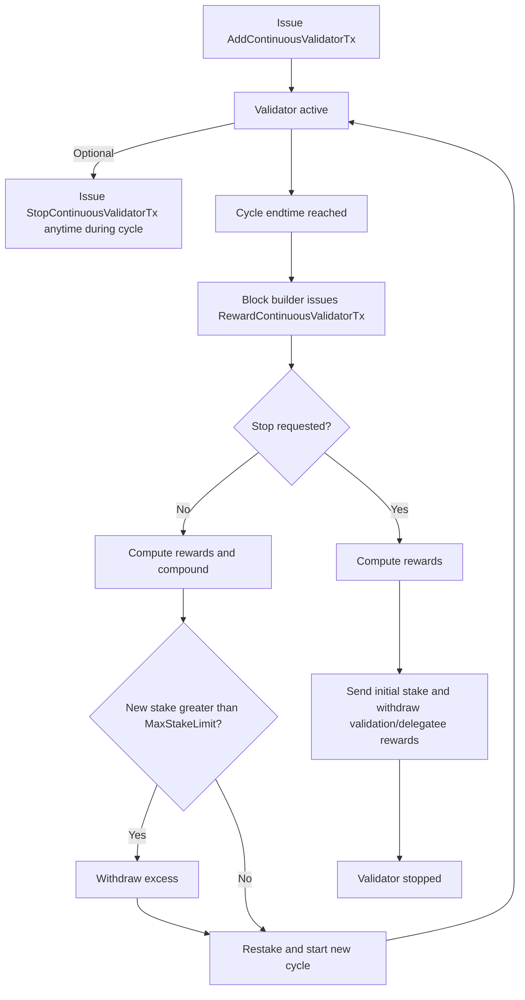

| ACP           | 236                                                         |
|:--------------|:------------------------------------------------------------|
| **Title**     | Continuous Staking                                          |
| **Author(s)** | Razvan Angheluta ([@rrazvan1](https://github.com/rrazvan1)) |
| **Status**    | Proposed                                                    |
| **Track**     | Standards                                                   |

## Abstract

This proposal introduces continuous staking for validators on the Avalanche P-Chain. Validators can stake their tokens
continuously, allowing their stake to compound over time, accruing rewards once per specified cycle.

## Motivation

The current staking system on the Avalanche P-Chain restricts flexibility for stakers, limiting their ability to respond
to changing market conditions or liquidity needs. Managing a large number of nodes is also challenging, as re-staking at
the end of each period is labor-intensive, time-consuming, and poses security risks due to
the required transaction signing. Additionally, tokens can remain idle at the end of a staking period
until stakers initiate the necessary transactions to stake them again.

## Specification

Continuous staking introduces a mechanism that allows validators to remain staked indefinitely, without having to
manually submit new staking transactions at the end of each period.

Instead of committing to a fixed endtime upfront, validators specify a cycle duration (period) when they submit an
`AddContinuousValidatorTx`. At the end of each cycle, the validator is automatically restaked for a new cycle of the
same duration, unless the validator has submitted a `StopContinuousValidatorTx`. If a validator submits a
`StopContinuousValidatorTx` during a cycle, the validator will continue validating until the end of the current cycle,
at which point the validator exits and the funds are unlocked. The minimum and maximum cycle lengths follow the same
protocol parameters as before (`MinStakeDuration` and `MaxStakeDuration`).

Delegator interaction remains unchanged, and the same constraints apply: a delegation period must fit entirely within
the validator’s cycle. Delegators cannot delegate across multiple cycles, since there is no guarantee that a validator
will continue validating after the current cycle. Essentially, it is not possible to delegate continuously.

Rewards accrue once per cycle, and are automatically added to the validator's existing stake in subsequent cycles, both
for validation rewards and for delegatee rewards. If the updated stake weight (previous stake + staking rewards +
delegatee rewards) exceeds the maximum stake limit defined in the network configuration, the excess amount is
automatically withdrawn and sent to `ValidatorRewardsOwner` and `DelegatorRewardsOwner`.

Because of the way `RewardValidatorTx` is structured, multiple instances cannot be issued without resulting in identical
transaction IDs. To resolve this, a new transaction type has been introduced for both rewarding and stopping continuous
validators: `RewardContinuousValidatorTx`. Along with the validator’s creation transaction ID, it also includes a
timestamp. For simplicity and consistency, any stake exceeding the maximum limit is withdrawn from the validator, and
the resulting UTXOs are tied to the `RewardContinuousValidatorTx` ID.

Note: Submitting an `AddContinuousValidatorTx` immediately followed by a `StopContinuousValidatorTx` replicates
the behavior of the current staking system.

### New P-Chain Transaction Types

The following new transaction types will be introduced to the P-Chain to support this functionality:

#### AddContinuousValidatorTx

```golang
type AddContinuousValidatorTx struct {
  // Metadata, inputs and outputs
  BaseTx `serialize:"true"`
  
  // Node ID of the validator
  ValidatorNodeID ids.NodeID `serialize:"true" json:"nodeID"`
  
  // Period (in seconds).
  Period uint64 `serialize:"true" json:"period"`
  
  // [Signer] is the BLS key for this validator.
  Signer signer.Signer `serialize:"true" json:"signer"`
  
  // Where to send staked tokens when done validating
  StakeOuts []*avax.TransferableOutput `serialize:"true" json:"stake"`
  
  // Where to send validation rewards when done validating
  ValidatorRewardsOwner fx.Owner `serialize:"true" json:"validationRewardsOwner"`
  
  // Where to send delegation rewards when done validating
  DelegatorRewardsOwner fx.Owner `serialize:"true" json:"delegationRewardsOwner"`
  
  // Fee this validator charges delegators as a percentage, times 10,000
  // For example, if this validator has DelegationShares=300,000 then they
  // take 30% of rewards from delegators
  DelegationShares uint32 `serialize:"true" json:"shares"`
  
  // Weight of this validator used when sampling
  Wght uint64 `serialize:"true" json:"weight"`
}

```

#### StopContinuousValidatorTx

```golang
type StopContinuousValidatorTx struct {
  // Metadata, inputs and outputs
  BaseTx `serialize:"true"`
  
  // ID of the tx that created the continuous validator.
  TxID ids.ID `serialize:"true" json:"txID"`
  
  // Authorizes this validator to be stopped.
  // It is a BLS Proof of Possession signature of the TxID using validator key.
  StopSignature [bls.SignatureLen]byte `serialize:"true" json:"stopSignature"`
}
```

`StopSignature` is the BLS Proof of Possession signature of the tx ID of `AddContinuousValidatorTx` using the validator
key.

#### RewardContinuousValidatorTx

```golang
type RewardContinuousValidatorTx struct {
    // ID of the tx that created the validator being removed/rewarded
    TxID ids.ID `serialize:"true" json:"txID"`

    // End time of the validator.
    Timestamp uint64 `serialize:"true" json:"timestamp"`
    
    unsignedBytes []byte // Unsigned byte representation of this data
}

```

## Backwards Compatibility

This change requires a network upgrade to make sure that all validators are able to verify and execute the new
introduced transactions.

## Considerations

Continuous staking makes it easier for users to keep their funds staked longer than with fixed-period staking, since it
involves fewer transactions, lower friction, and reduced risks.
Greater staking participation leads to stronger overall network security.

Validators benefit by not having to manually restart at the end of each cycle, which reduces transaction volume and the
risk of network congestion.

However, the uptime risk per cycle slightly increases depending on cycle length and validator performance. For example,
missing five days in a one-year cycle will still yield validation rewards, whereas missing five days in a two-week cycle
may affect rewards.

## Flow of a Continuous Validator

## Open Questions

- Should rewards be automatically restaked into the validator's active stake?

- Should the `AddContinuousValidatorTx` transaction allow specifying a reward withdrawal frequency?

- If auto-restaking causes the total stake to exceed the maximum allowed limit, should all accumulated rewards (from the
  last cycle) be withdrawn instead of only the excess amount? This approach favors simplicity and results in a less
  error-prone implementation.

## Copyright

Copyright and related rights waived via [CC0](https://creativecommons.org/publicdomain/zero/1.0/).
