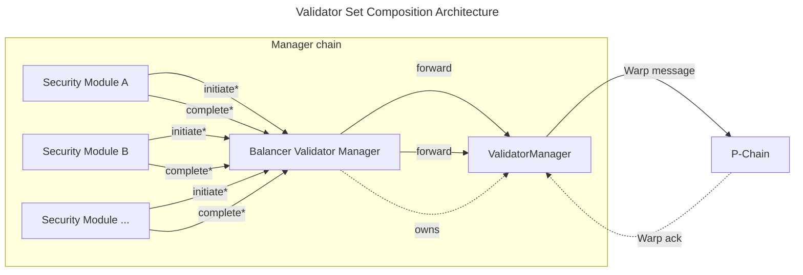

| ACP              | 280                                                                                                    |
| :--------------- | :----------------------------------------------------------------------------------------------------- |
| **Title**        | Validator Set Composition Standard                                                                     |
| **Author(s)**    | Gonzalo Etse ([@gonzaloetjo](https://github.com/gonzaloetjo))                                          |
| **Status**       | Proposed                                                                                               |
| **Track**        | Best Practices                                                                                         |
| **Dependencies** | [ACP-77](../77-reinventing-subnets/README.md), [ACP-99](../99-validatorsetmanager-contract/README.md)  |

## Abstract

This ACP standardizes a composition layer that lets multiple security modules share a single [ACP-99](../99-validatorsetmanager-contract/README.md) ValidatorManager.

We define `IBalancerValidatorManager`, which wraps a ValidatorManager and re-exposes its lifecycle interface through delegation, adding per-module weight partitioning and module-exclusive validator assignment. We also define `ISecurityModule`, a minimal interface that security modules implement to plug into any compliant balancer. Security modules call the balancer using the standard lifecycle functions declared in `IBalancerValidatorManager`, so modules from different teams can plug into any compliant balancer.

## Motivation

[ACP-99](../99-validatorsetmanager-contract/README.md) specifies the initiate functions as internal, so the contract that wraps them controls all validator lifecycle operations. Ava Labs' [icm-services](https://github.com/ava-labs/icm-services/tree/validator-manager-v2.1.0/contracts/validator-manager) already ships separate controllers that compose a ValidatorManager, such as `PoAManager` for permissioned operation and `StakingManager` variants for proof-of-stake, but because the ValidatorManager is single-owner, multiple security models cannot share the same validator set. An L1 that wants both PoA and PoS validators managed together must deploy separate ValidatorManager instances, each with its own isolated set, or write a custom wrapper.

The same limitation applies to any scenario where multiple security models must coexist: gradual PoA-to-PoS transitions (where both run side by side instead of a hard cutover), institutional validators alongside community stakers, or multiple staking tokens with independent weight accounting.

[ACP-99](../99-validatorsetmanager-contract/README.md), in its multi-contract design example, anticipates one or more security modules but leaves their specification explicitly out of scope. Today, each team building multi-module validator management writes a custom wrapper around the ValidatorManager. These wrappers are incompatible, making it difficult to build portable security modules or shared tooling. This ACP fills that gap by standardizing a composition layer, the "Balancer Validator Manager" (so called because it balances validator weight across multiple security modules), that enforces per-module weight caps and module-exclusive validator assignment, enabling security modules from different teams to be used interchangeably with any compliant balancer.

## Specification

The key words "MUST", "MUST NOT", "REQUIRED", "SHALL", "SHALL NOT", "SHOULD", "SHOULD NOT", "RECOMMENDED", "MAY", and "OPTIONAL" in this document are to be interpreted as described in [RFC 2119](https://www.ietf.org/rfc/rfc2119.txt).

### Overview

This standard defines a balancer contract that coordinates multiple security modules over a single ValidatorManager, along with the interface that security modules implement to plug in.

**Terminology:** This ACP uses "ValidatorManager" to refer to ACP-99's `ACP99Manager` contract (the concrete instance the balancer owns and delegates to). `IACP99Manager` refers to the Solidity interface for ACP-99's `ACP99Manager`. `PendingAdded` refers to the ACP-99 `ValidatorStatus` value assigned to a validator whose registration has been initiated but not yet acknowledged by the P-Chain.



**Initiate flow:** A security module calls an `initiate*` function on the balancer, which forwards to the ValidatorManager, which sends a Warp message to the P-Chain.

**Complete flow:** After the P-Chain acknowledges the operation (via a Warp message back to the ValidatorManager), anyone can call `complete*` on the security module, which forwards through the balancer to the ValidatorManager to finalize the state change. (ACP-99's multi-contract example routes completion calls directly to the manager; this ACP routes them through the security module so the balancer can verify module assignment before forwarding.)

The Balancer Validator Manager is the sole `owner` of the underlying ValidatorManager. This centralized ownership is required so that a single contract can enforce per-module weight caps and prevent cross-module interference. Security modules interact with the validator set exclusively through the balancer: initiate operations are gated by module assignment, and complete operations verify that the calling module is assigned to the validator being finalized. The exact ordering of these checks relative to the underlying ValidatorManager call is left to the implementer, provided all invariants hold within the same transaction. The balancer delegates all standard lifecycle functions to the owned ValidatorManager (`completeValidatorRegistration`, `completeValidatorRemoval`, `getValidator`, `l1TotalWeight`, `subnetID`, and resend functions for registration and removal messages), re-exposing them through `IBalancerValidatorManager`.

`initializeValidatorSet` is delegated to the underlying ValidatorManager. This ACP does not standardize module assignment for the initial validator set. A compliant deployment must either:

1. wrap an already-initialized ValidatorManager and assign all existing validators to modules during balancer initialization, or
2. provide an implementation-specific initialization that atomically assigns every initial validator to a security module before any module-mediated operation is allowed.

Initialization is intentionally left implementation-specific because it is a one-time deployment concern; the interoperability surface for security modules is the ongoing `IBalancerValidatorManager` and `ISecurityModule` interfaces.

### `IBalancerValidatorManager`

The interface extends `IACP99Manager` (the Solidity interface for ACP-99's `ACP99Manager`) rather than `IValidatorManager`, which is an icm-services implementation detail that adds functions outside the composition surface (`migrateFromV1`, `getNodeValidationID`, `getChurnPeriodSeconds`). It declares the `initiate*` functions as `external`; ACP-99 specifies these as `internal`, and this ACP standardizes their external form for the delegation pattern. The resend functions for registration and removal originate from icm-services' `IValidatorManager` implementation and are included here because the delegation pattern requires them on the balancer surface. `PChainOwner` is defined in ACP-99 (originating from ACP-77) and included in `IACP99Manager`.

```solidity
interface IBalancerValidatorManager is IACP99Manager {
    /// @notice Initiates a validator registration, sending a Warp message to the P-Chain.
    /// @param nodeID The node ID of the validator.
    /// @param blsPublicKey The BLS public key of the validator.
    /// @param remainingBalanceOwner The P-Chain owner for the remaining balance.
    /// @param disableOwner The P-Chain owner that can disable the validator.
    /// @param weight The weight of the validator being registered.
    /// @return validationID The ID of the validator registration.
    function initiateValidatorRegistration(
        bytes memory nodeID,
        bytes memory blsPublicKey,
        PChainOwner memory remainingBalanceOwner,
        PChainOwner memory disableOwner,
        uint64 weight
    ) external returns (bytes32 validationID);

    /// @notice Initiates validator removal, sending a Warp message to the P-Chain.
    /// @param validationID The ID of the validation period being ended.
    function initiateValidatorRemoval(
        bytes32 validationID
    ) external;

    /// @notice Initiates a validator weight update, sending a Warp message to the P-Chain.
    /// @param validationID The ID of the validation period being updated.
    /// @param newWeight The new weight to set for the validator.
    /// @return nonce The nonce of the weight update message.
    /// @return messageID The ID of the weight update message.
    function initiateValidatorWeightUpdate(
        bytes32 validationID,
        uint64 newWeight
    ) external returns (uint64 nonce, bytes32 messageID);

    /// @notice Resends a validator registration message to the P-Chain.
    /// @param validationID The ID of the validation period being registered.
    function resendRegisterValidatorMessage(
        bytes32 validationID
    ) external;

    /// @notice Resends a validator removal message to the P-Chain.
    /// @param validationID The ID of the validation period being ended.
    function resendValidatorRemovalMessage(
        bytes32 validationID
    ) external;

    /// @notice Emitted when a security module is registered, updated, or removed.
    /// @param securityModule The address of the security module.
    /// @param maxWeight The maximum total weight for validators managed by this module.
    ///                  A value of 0 indicates module removal.
    event SetUpSecurityModule(address indexed securityModule, uint64 maxWeight);

    /// @notice Emitted when a security module's current weight changes.
    /// @param securityModule The address of the security module.
    /// @param oldWeight The previous weight.
    /// @param newWeight The new weight.
    /// @param maxWeight The module's maximum weight allocation.
    event SecurityModuleWeightUpdated(
        address indexed securityModule,
        uint64 oldWeight,
        uint64 newWeight,
        uint64 maxWeight
    );

    /// @notice Registers a new security module or updates an existing module's max weight.
    ///         Setting maxWeight to 0 removes the module.
    /// @param securityModule The address of the security module.
    /// @param maxWeight The maximum total weight allowed for this module's validators.
    function setUpSecurityModule(address securityModule, uint64 maxWeight) external;

    /// @notice Returns the list of registered security module addresses.
    function getSecurityModules() external view returns (address[] memory);

    /// @notice Returns the current and maximum weight for a security module.
    /// @param securityModule The address of the security module.
    /// @return weight The module's current total validator weight.
    /// @return maxWeight The module's maximum allowed weight.
    function getSecurityModuleWeights(
        address securityModule
    ) external view returns (uint64 weight, uint64 maxWeight);

    /// @notice Returns the security module assigned to a validator.
    /// @param validationID The validation ID.
    /// @return The assigned module's address, or address(0) if unassigned.
    function getValidatorSecurityModule(
        bytes32 validationID
    ) external view returns (address);

    /// @notice Returns whether a validator has an in-flight weight update.
    /// @param validationID The validation ID.
    function isValidatorPendingWeightUpdate(
        bytes32 validationID
    ) external view returns (bool);

    /// @notice Resends a pending validator weight update message to the P-Chain.
    /// @param validationID The ID of the validation period being updated.
    function resendValidatorWeightUpdate(
        bytes32 validationID
    ) external;
}
```

The `initiate*` and resend functions are declared directly in `IBalancerValidatorManager`; the `complete*` functions and view functions (`getValidator`, `l1TotalWeight`, `subnetID`) are inherited from `IACP99Manager`. All are delegated to the owned ValidatorManager, with module-authorization checks and per-module weight accounting added on top. `IBalancerValidatorManager` declares two module-specific events: `SetUpSecurityModule` (emitted on module registration, update, or removal) and `SecurityModuleWeightUpdated` (emitted when a module's current weight changes). All validator lifecycle events are emitted by the underlying ValidatorManager during delegation and are not re-declared.

### `ISecurityModule`

We propose the following interface that security modules implement to plug into a compliant balancer:

```solidity
interface ISecurityModule {
    /// @notice Completes a validator registration after P-Chain acknowledgment.
    /// @param messageIndex The index of the Warp message carrying the registration result.
    /// @return validationID The ID of the acknowledged validation period.
    function completeValidatorRegistration(
        uint32 messageIndex
    ) external returns (bytes32 validationID);

    /// @notice Completes a validator removal after P-Chain acknowledgment.
    /// @param messageIndex The index of the Warp message carrying the removal result.
    /// @return validationID The ID of the acknowledged validation period.
    function completeValidatorRemoval(
        uint32 messageIndex
    ) external returns (bytes32 validationID);

    /// @notice Completes a validator weight update after P-Chain acknowledgment.
    /// @param messageIndex The index of the Warp message carrying the weight update acknowledgment.
    /// @return validationID The ID of the validation period.
    /// @return nonce The acknowledged validator message nonce.
    function completeValidatorWeightUpdate(
        uint32 messageIndex
    ) external returns (bytes32 validationID, uint64 nonce);
}
```

Every security module must implement `ISecurityModule`.

The interface only defines completion functions. Initiation functions (e.g., `initiateValidatorRegistration`) are module-specific: a PoA module gates them behind `onlyOwner`, a PoS module gates them behind stake deposit logic. The completion functions are permissionless so that any caller (keepers, governance contracts, etc.) can finalize validator state after P-Chain acknowledgment, keeping the system moving regardless of the module's access control model.

Each completion function must forward the call to the balancer, which in turn forwards to the underlying ValidatorManager. The security module must be the `msg.sender` to the balancer so the balancer can verify which module is calling.

### Behavioral Requirements

Implementations of `IBalancerValidatorManager` MUST satisfy the following rules:

1. **Per-module weight accounting.** The balancer MUST track each module's current weight and update it per operation as follows:

   | Operation | Per-module weight change |
   |-----------|------------------------|
   | `initiateValidatorRegistration` | module weight **+= validator weight** |
   | `initiateValidatorRemoval` | module weight **-= validator weight** |
   | `initiateValidatorWeightUpdate` | module weight **+= (newWeight - oldWeight)** |
   | `completeValidatorRegistration` | no per-module weight change |
   | `completeValidatorRemoval` (active/removed validator) | no per-module weight change (weight was already deducted at initiation) |
   | `completeValidatorRemoval` (expired `PendingAdded`) | module weight **-= registration weight** (see Requirement 12) |
   | `completeValidatorWeightUpdate` | no per-module weight change (nonce bookkeeping only) |

   Per-module weight changes take effect at initiation time because the balancer MUST mirror the underlying ValidatorManager's `l1TotalWeight()` accounting. This is manager-chain accounting only: ACP-99's completion-time language governs validator activation and P-Chain consensus effect, while this ACP's initiation-time rule governs balancer-local module accounting. The P-Chain applies the weight change to consensus after its Warp acknowledgment completes the round-trip.

   **Global invariant:** the sum of all modules' current weights MUST equal the ValidatorManager's `l1TotalWeight()` after each state-changing operation completes.

2. **Per-module weight cap.** For each registered module, its current weight MUST NOT exceed its configured `maxWeight`. The balancer MUST revert any `initiateValidatorRegistration` or `initiateValidatorWeightUpdate` that would violate this constraint.

3. **Module-exclusive validator assignment.** Each validator MUST be assigned to exactly one security module. Only the assigned module MAY call initiate or complete operations on that validator. The balancer MUST revert if a non-assigned module attempts to operate on a validator. (Shared ownership would require weight-split accounting and cross-module coordination on removal; separate validators per module achieves the same result with less complexity.)

4. **Validator assignment lifecycle.** A validator MUST be assigned to the calling module at `initiateValidatorRegistration` time. The validator-to-module assignment MUST be cleared on removal completion (`completeValidatorRemoval`).

5. **Per-module validator count.** The balancer MUST track per-module validator count: increment on `initiateValidatorRegistration`, decrement on `completeValidatorRemoval`.

6. **Single in-flight weight update.** The balancer MUST NOT allow `initiateValidatorWeightUpdate` or `initiateValidatorRemoval` on a validator that has a pending (unacknowledged) weight update.

7. **Non-zero weight.** The balancer MUST NOT allow `initiateValidatorRegistration` with a `weight` of 0, and MUST NOT allow `initiateValidatorWeightUpdate` with a `newWeight` of 0. Weight-to-zero operations MUST use `initiateValidatorRemoval` instead.

8. **Monotonic nonce enforcement.** `completeValidatorWeightUpdate` MUST reject acknowledgments with a nonce ≤ the validator's last received nonce (stale/duplicate) and MUST reject nonces > the validator's last sent nonce (future/invalid).

9. **Module removal safety.** A module MUST NOT be removed (maxWeight set to 0) while it has non-zero current weight or any assigned validators.

10. **Max weight floor.** When updating an existing module's `maxWeight`, the new value MUST NOT be lower than the module's current weight.

11. **Admin restriction.** `setUpSecurityModule` MUST be restricted to the balancer's admin (e.g., governance contract, multisig, or timelock).

12. **Expired registration weight recovery.** When `completeValidatorRemoval` is called for a validator whose registration expired (i.e., the validator was in `PendingAdded` status and the P-Chain did not acknowledge it within the expiry window), the balancer MUST deduct the validator's registration weight from the module's current weight. This is the only `complete*` path that changes per-module weight, because `initiateValidatorRemoval` was never called to deduct it. The balancer MUST also decrement the module's validator count and clear the validator-to-module assignment.

13. **Initial validator module assignment.** All validators present at `initializeValidatorSet` time MUST be assigned to a security module before any module-mediated operation is allowed. The balancer MUST NOT allow `initiate*` or `complete*` calls for any validator that lacks a module assignment.

### Module Registration

The balancer's admin (typically a governance contract or multisig) manages security module registration through `setUpSecurityModule`:

- **Register:** Call `setUpSecurityModule(module, maxWeight)` with `maxWeight > 0`.
- **Update cap:** Call `setUpSecurityModule(module, newMaxWeight)`. The new cap must be at least the module's current weight.
- **Remove:** Call `setUpSecurityModule(module, 0)`. The module must have zero current weight and no assigned validators.

### Expired Registrations

Each validator registration includes an expiry (per ACP-77). If the P-Chain does not acknowledge the registration before it expires, the validator can be cleaned up via `completeValidatorRemoval` (see Requirement 12).

### Message Resending

Warp messages may fail to be delivered. ValidatorManager implementations (such as icm-services') expose resend functions for registration and removal messages (`resendRegisterValidatorMessage`, `resendValidatorRemovalMessage`), which the balancer delegates directly. No equivalent exists for weight updates, so the balancer must construct and re-emit weight update messages itself. This is why `resendValidatorWeightUpdate` is defined on `IBalancerValidatorManager` rather than delegated. All resend functions can be permissionless since they only re-emit existing messages without changing state.

## Backwards Compatibility

This ACP is purely additive and does not modify ACP-77 or ACP-99:

- Existing ValidatorManager deployments continue to function unchanged.
- The balancer is deployed as a new contract that becomes the `owner` of an existing or new ValidatorManager.
- L1s currently using a single-owner model (e.g., a `PoAManager` or `StakingManager` as the ValidatorManager owner) can migrate to the composition pattern (see Appendix A for the full process).

## Reference Implementation

A reference implementation is available in the [Suzaku Contracts Library](https://github.com/suzaku-network/suzaku-contracts-library):

- [`BalancerValidatorManager.sol`](https://github.com/suzaku-network/suzaku-contracts-library/blob/balancer-validator-manager-v1.0.1/src/contracts/ValidatorManager/BalancerValidatorManager.sol) - balancer implementation
- [`ISecurityModule.sol`](https://github.com/suzaku-network/suzaku-contracts-library/blob/balancer-validator-manager-v1.0.1/src/interfaces/ValidatorManager/ISecurityModule.sol) - security module interface
- [`PoASecurityModule.sol`](https://github.com/suzaku-network/suzaku-contracts-library/blob/balancer-validator-manager-v1.0.1/src/contracts/ValidatorManager/SecurityModule/PoASecurityModule.sol) - reference PoA security module

The implementation has been audited by [Cyfrin](https://github.com/suzaku-network/suzaku-contracts-library/blob/balancer-validator-manager-v1.0.1/audits/ValidatorManager/2025-10-10-cyfrin-suzaku-balancer-validator-v2.0.pdf), [Omniscia](https://github.com/suzaku-network/suzaku-contracts-library/blob/balancer-validator-manager-v1.0.1/audits/ValidatorManager/05_09_2025_SuzakuNetwork_ValidatorManager_Omniscia_SecurityAudit.pdf), and Octane (Constant AI).

## Security Considerations

### Module Isolation

The balancer enforces strict validator-to-module assignment. A security module can only operate on validators it registered, so a compromised or malicious module cannot directly initiate or complete operations on validators assigned to other modules.

### Weight Cap Enforcement

Per-module weight caps prevent any single module from dominating the validator set. Even if a module's internal logic is compromised, it cannot exceed its allocated portion of the validator set.

### Pending Operation Ordering

Only one weight update can be in flight per validator at a time. This prevents race conditions where multiple unacknowledged weight changes could lead to inconsistent state between the balancer's weight accounting and the P-Chain's view. Similarly, validator removal is blocked while a weight update is pending.

### Monotonic Nonce Enforcement

The balancer validates that weight update acknowledgment nonces are strictly monotonic, rejecting both stale (already-seen) and future (not-yet-sent) nonces. This prevents replay attacks and ensures each completion matches the weight update that was actually sent.

### Interaction with ValidatorManager Churn Limits

ValidatorManager implementations may enforce churn limits (a bound on how much total weight can change within a configurable time window). Churn is not specified by ACP-99 but is present in existing implementations. When churn limits are active, they are tracked globally across the entire ValidatorManager, not per module. All modules share a single churn budget, so a high-activity module can exhaust the budget and cause other modules' operations to revert for the remainder of the churn period.

Operators deploying multi-module configurations with churn-enabled ValidatorManagers should size churn budgets (percentage and period length) for aggregate module activity, coordinate operationally sensitive actions (e.g., emergency validator replacement) to preserve churn capacity, and monitor the ValidatorManager's publicly readable churn tracker state. A future revision of the ValidatorManager standard could address this by supporting per-caller churn partitioning, but such a change is outside the scope of this ACP.

### P-Chain State Divergence

The balancer's per-module weight accounting tracks manager-chain state only. ACP-77 defines P-Chain-side events (balance exhaustion, `DisableL1ValidatorTx`, `IncreaseL1ValidatorBalanceTx`) that change a validator's consensus participation without producing a Warp message to the manager chain, so the balancer cannot observe them. Operators should monitor P-Chain validator status and balance levels off-chain, and use `initiateValidatorRemoval` through the appropriate security module to reconcile stale validators when divergence is detected.

### Expired Registration Handling

If a validator's P-Chain registration expires, the balancer must correctly refund the weight when `completeValidatorRemoval` is called for the expired validator. Failure to handle this case would permanently reduce the module's available weight capacity.

### Reentrancy

The completion functions are called by security modules (external contracts), which introduces a reentrancy surface if a module is malicious or compromised. Implementations should use reentrancy guards on state-changing functions to prevent a malicious module from re-entering the balancer mid-operation and corrupting weight accounting or validator assignment state.

### Module Liveness and Recovery

If a security module becomes non-functional (implementation bug, lost upgrade keys, or malicious self-destruct), validators assigned to that module cannot be removed or updated through the standard interface. The module-exclusive assignment model (Requirement 3) means no other actor, including the admin, can call initiate or complete operations for those validators. The module's weight remains permanently allocated, its entry cannot be removed (Requirement 9 requires zero weight and zero validators), and the stuck validators persist on the P-Chain. Unlike the scenario described in P-Chain State Divergence above (where a functional module can reconcile stale validators via `initiateValidatorRemoval`), a bricked module makes that reconciliation path unavailable.

This is a direct consequence of the composition pattern. In ACP-99's single-owner model, a bricked owner locks the entire validator set; if the owner is an upgradeable proxy, a single upgrade restores control over all validators. In the composition model, a bricked module locks only its own validators while other modules retain full control of their own validators, and the module or the balancer can be upgraded to restore control. However, there is no standard (non-upgrade) path to reclaim the locked weight, and the accounting divergence (locked weight inflating `l1TotalWeight()`) persists until recovery.

Recovery typically requires upgradeability: if both the security module and the balancer are upgradeable, governance can patch the module or add an implementation-specific force-removal path. The `disableOwner` P-Chain keys for validators should not be custodied by the module contract, to preserve the P-Chain deactivation escape described in P-Chain State Divergence (damage mitigation, not accounting cleanup). Deployments that cannot rely on upgradeability should evaluate whether an alternative recovery mechanism is appropriate for their trust model.

### Admin Trust Model

The balancer's admin controls module registration and weight cap configuration through `setUpSecurityModule`. Because this takes effect immediately, a compromised admin key can register a malicious module and begin accumulating validator weight in the same block. With typical churn parameters (20% maximum churn, 1-day churn period), an attacker approaches two-thirds of total weight within approximately 6 churn periods (assuming worst-case churn usage each period), at which point they control BLS aggregate signatures and can forge arbitrary Warp messages.

This trust model is inherited from ACP-99, where the ValidatorManager's single owner has equivalent power over the validator set. The composition layer does not amplify admin risk: it introduces a module-registry control surface (`setUpSecurityModule`), but all validator operations still pass through the same underlying ValidatorManager and are subject to the same churn limits regardless of which module initiates them. The admin also cannot move validators between modules or bypass the two-phase lifecycle.

We recommend using a governance contract, multisig, or timelock as the admin to limit single-point-of-failure risk.

## Open Questions

### Should weight caps be mandatory?

The current specification requires every module to have a `maxWeight`. An alternative design could allow uncapped modules that share the remaining weight after capped modules are accounted for. We believe explicit caps are safer, but welcome discussion on whether a more flexible model is needed.

### Should there be a standard for transferring validators between modules?

The current specification does not allow moving a validator from one module to another. A transfer would require removal and re-registration, which involves P-Chain round-trips. A direct transfer mechanism could be more efficient but adds complexity.

### Should the standard include a recovery mechanism for bricked modules?

If a security module becomes non-functional, validators assigned to it cannot be removed through the standard interface (see Module Liveness and Recovery above). The current specification relies on contract upgradeability as the primary recovery path. An alternative is to define a standard recovery mechanism, such as a governance-gated force-removal. We welcome discussion on whether such a mechanism should be part of the standard interface, left to implementors, or addressed only through deployment guidance.

### Should module registration include a mandatory delay?

The current specification allows `setUpSecurityModule` to take effect immediately (see Admin Trust Model above). Comparable multi-party staking coordination systems enforce protocol-level delays (days to weeks) on analogous operations. However, ACP-99 does not require any delay on the ValidatorManager owner's actions, and a mandatory delay could interfere with legitimate emergency operations (e.g., registering a replacement module when another is compromised). We welcome discussion on whether a delay should be part of the standard interface, left to implementors, or specified as a deployment recommendation.

## Appendix A: Migration from Single-Owner ValidatorManager (Informative)

Migration depends on implementation-specific details (storage layout, upgrade proxy type, existing controller interfaces, deployment orchestration), so this guidance is informative rather than normative.

This appendix describes a migration path for L1s that currently use a single-owner ValidatorManager (e.g., with `PoAManager` or `StakingManager` as owner) and wish to adopt the composition pattern.

### Migration Steps

1. **Deploy the balancer and the initial security module.** Steps 1-2 may happen in a single deployment transaction. The balancer is configured with a reference to the existing ValidatorManager address and the list of current validators (by node ID) to be assigned to the initial module. Balancer initialization (step 3) is deferred until after ownership transfer.

2. **Transfer ValidatorManager ownership** from the current owner to the balancer.

   > Note: Implementations can optionally expose a non-standard `transferValidatorManagerOwnership` helper. Ownership transfer alone does not migrate module weights, validator assignments, or per-module validator counts. Any balancer-to-balancer migration must reconstruct that state explicitly.

3. **Initialize the balancer.** Once the balancer owns the ValidatorManager, initialization:
   - Reads the current `l1TotalWeight()` from the ValidatorManager.
   - Verifies that the sum of migrated validators' weights equals the total weight.
   - Assigns all migrated validators to the initial security module.
   - Sets the initial module's weight to the total migrated weight.

4. **Register additional modules** as needed via `setUpSecurityModule`.

### Key Considerations

- Migration should account for all current validators, including those in `PendingAdded` status.
- The initial module's `maxWeight` should be at least equal to the current `l1TotalWeight()`.
- No validator lifecycle operations should be in flight during the ownership transfer to avoid inconsistent state.

### Adapting Existing icm-services Controllers

Ava Labs' `PoAManager` and `StakingManager` already compose a ValidatorManager via an `IValidatorManager` reference (icm-services' implementation-level interface, which extends `IACP99Manager` with additional functions). Adapting them as security modules requires implementing `ISecurityModule` and changing the VM reference type to `IBalancerValidatorManager` (from `IValidatorManager` in `StakingManager`, or `IValidatorManagerExternalOwnable` in `PoAManager`). The 5 lifecycle function signatures (`initiate*` and resend) are ABI-identical between the two interfaces; the 3 `IValidatorManager`-only functions (`migrateFromV1`, `getNodeValidationID`, `getChurnPeriodSeconds`) are not part of the composition surface and are not needed by controllers acting as security modules. Controllers must also expose the 3 `ISecurityModule` completion functions (`completeValidatorRegistration`, `completeValidatorRemoval`, `completeValidatorWeightUpdate`) as external entrypoints that forward through the balancer. For upgradeable contracts like `StakingManager`, this is a storage-compatible change (the storage slot holds a raw address). `PoAManager` uses an immutable reference and holds no user state, so a fresh deployment is needed.

## Acknowledgments

Special thanks to the [Ava Labs](https://www.avalabs.org/) team for their work on ACP-77, to Gauthier Leonard ([@Nuttymoon](https://github.com/Nuttymoon)) and Cam Schultz ([@cam-schultz](https://github.com/cam-schultz)) for ACP-99, and to [Cyfrin](https://www.cyfrin.io/), [Omniscia](https://omniscia.io/), and [Octane](https://octane.security/) for auditing the reference implementation.

## Copyright

Copyright and related rights waived via [CC0](https://creativecommons.org/publicdomain/zero/1.0/).
