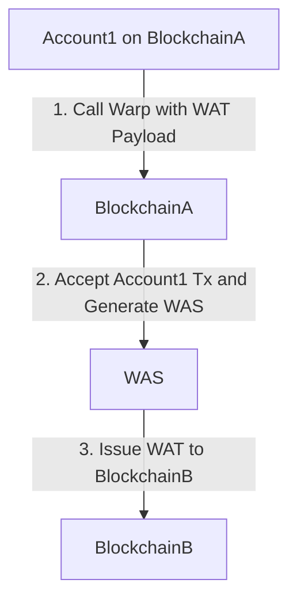

```text
ACP: 73
Title: Warp Addressed Transactions
Author(s): Aaron Buchwald <https://github.com/aaronbuchwald>
Discussions-To: https://github.com/avalanche-foundation/ACPs/discussions/68
Status: Implementable
Track: Standards
```

## Abstract

Add a standard for `Warp Addressed Transactions` to enable any `(blockchainID, address)` pair to sign a a transaction that is executable on any destination chain. This is intended as a general standard that can be implemented by any VM on the Avalanche Network. As the first instance, this ACP proposes integrating Warp Addressed Transactions to the P-Chain to enable Subnet Driven Validator Sets as first laid out in https://github.com/avalanche-foundation/ACPs/discussions/68.

## Motivation

Subnets are currently created and orchestrated entirely on the Avalanche P-Chain. Many Subnets may have the desire or need to maintain greater sovereignty over their validator set, reward curve, and overall tokenomics than what is available on the P-Chain.

Warp Addressed Transactions enable transferring ownership of a Subnet to a `(blockchainID, address)` pair, which can be an arbitary program on any chain in the Avalanche Ecosystem (ex. manage your validator set from a contract on your own chain or a contract on the C-Chain).

By transferring ownership to a Warp Derived Address, Subnets can manage their validator set against a generic API.

In the immediate term, this accomplishes two critical goals for Subnets:

1. Enable Token Standard PoS Subnets (ERC-20 Staking)
2. Enable generic validator set and tokenomics management

Further, this standard could be implemented by any VM that wants to enable Warp Addressed Transactions.

## Introduced Terminology

* `Warp Transaction Signature` - a Warp signature used to authorize a generic transaction payload
* `Warp Addressed Transaction` - generic transaction that uses a Warp Transaction Signature for authorization
* `Warp Derived Address` - the address derived from a Warp Transaction Signature for which the signature provides authorization

## Specification

A Warp Addressed Signature includes the fields:

* `warpSignature`
* `networkID`
* `sourceChainID`
* `sourceAddress`
* `txHash`

We assume the transaction payload itself contains replay protection, so there's no need to include the `destinationChainID` in the payload.

The specification to verify a `WarpAddressedSignature` for a generic transaction is defined here:

```python
from dataclasss import dataclass
from abc import ABC, abstractmethod

# Interface defined in AvalancheGo:
# https://github.com/ava-labs/avalanchego/blob/12cd5ec53a6fc6226256565c8048b79d3aae76eb/snow/validators/state.go#L17
class PChainState(ABC):
	@abstractmethod
	def get_minimum_height() -> int: pass
	
	@abstractmethod
	def get_current_height() -> int: pass

	@abstractmethod
	def get_subnet_id(chainID: bytes) bytes: pass

	@abstractmethod
	def get_validator_set(height: int, subnetID: bytes) -> dict: pass

class WarpAddresser(ABC):
	@abstractmethod
	def derive_warp_address(source_chain_id: bytes, source_address: bytes):

@dataclass
class WarpParams:
	network_id: int
	p_chain_state: PChainState
	p_chain_height: int
	quorum_num: int
	quorum_denom: int

@dataclass
class AddressedPayload:
	source_address: bytes
	payload: bytes

class WarpPayload(ABC):
	@abstractmethod
	def get_bytes() -> bytes: pass

	@abstractmethod
	def get_addressed_payload() -> AddressedPayload: pass

@dataclass
class UnsignedMessage:
	network_id: int
	source_chain_id: bytes
	warp_payload: WarpPayload

class WarpSignature(ABC):
	@abstractmethod
	def verify(
		msg: UnsignedMessage,
		warp_params: WarpParams,
	): pass

@dataclass
class WarpMessage:
	signature: WarpSignature
	unsigned_message: UnsignedMessage

class Transaction(ABC):
	@abstractmethod
	def hash() -> bytes: pass

	@abstractmethod
	def sender() -> bytes: pass

def verify_warp_signature(
	warp_params: WarpParms,
	addresser: WarpAddresser,
	tx: Transaction,
	msg: Message,
):
	addressed_payload = msg.unsigned_message.get_addressed_payload()
	assert tx.hash() == addressed_payload.payload
	assert tx.sender() == addresser.derive_warp_address(msg.source_chain_id, addressed_payload.source_address)
	assert msg.signature.verify(
		msg.unsigned_message,
		warp_params
	)
```

To illustrate the full flow, we provide a sequence graph showing the issuance of a Warp Addressed Transaction from Account1 on BlockchainA to BlockchainB. Note that there are no restrictions on whether BlockchainA and BlockchainB are the same, different, on the same Subnet, or the Primary Network. They only need to agree on the standard for Warp Addressed Transactions.

To keep the diagram compact, we use the following abbreviations:

* `WAT` - Warp Addressed Transaction
* `WAS` - Warp Addressed Signature



## Backwards Compatibility

This proposes a new standard that can be adopted by VMs on a case-by-case basis and an integration on the Avalanche P-Chain.

Every VM must consider if they should implement Warp Addressed Transactions and the proper way to activate them if they choose to do so.

On the P-Chain, this proposal ensures that previous signature schemes remain unaffected by these changes and adds an alternative signature scheme, which requires a coordinated network upgrade to activate on the P-Chain.

## Reference Implementation

Here we provide a reference implementation introducing `WarpAddressedSignatures` to the P-Chain's PlatformVM in the form of a `WarpAddressedCredential`. `WarpAddressedCredential` is an alternative to the only currently supported signature scheme credential: [secp256k1fx.Credential](https://github.com/ava-labs/avalanchego/blob/ddf66eaed1659c2caa8531bbda83b360ca85900e/vms/secp256k1fx/credential.go#L17).

This credential type is used on the P-Chain through the PlatformVM's [Fx interface](https://github.com/ava-labs/avalanchego/blob/master/vms/platformvm/fx/fx.go).

Each of these secp256k1fx verification checks performs basic transaction validity checks, type checks on the credential type, and eventually passes through to call [VerifyCredentials](https://github.com/ava-labs/avalanchego/blob/ddf66eaed1659c2caa8531bbda83b360ca85900e/vms/secp256k1fx/fx.go#L180).

This reference implementation assumes that the type checks are changed to allow for an alternative credential type, the remaining transaction validity checks are kept identical, and the only substantive change is the modification to credential verification.

The credential verification is defined on a new `Warp Fx` and `WarpAddressedCredential` to authorize the use of any inputs that specify a single address matching the `WarpAddressedCredential`. We assume that deriving an address from a standard `WarpAddressedCredential` is specific to the VM implemenation, and define that address on the P-Chain to be given by `ripemd160(sha256(sourceChainID, sourceAddress))`. This is chosen for uniformity with the address derivation from a secp256k1 public key and to maintain the same 20 byte address format currently used on the P-Chain to minimize the necessary changes.

```go
// Copyright (C) 2019-2024, Ava Labs, Inc. All rights reserved.
// See the file LICENSE for licensing terms.

package fx

import (
	"bytes"
	"context"
	"fmt"

	"github.com/ava-labs/avalanchego/ids"
	"github.com/ava-labs/avalanchego/snow/validators"
	"github.com/ava-labs/avalanchego/utils/hashing"
	"github.com/ava-labs/avalanchego/utils/timer/mockable"
	"github.com/ava-labs/avalanchego/vms/platformvm/warp"
	"github.com/ava-labs/avalanchego/vms/platformvm/warp/payload"
	"github.com/ava-labs/avalanchego/vms/secp256k1fx"
)

type Fx struct {
	networkID    uint32
	clock        mockable.Clock
	bootstrapped bool

	pChainState          validators.State
	quorumNum, quorumDen uint64
}

// VerifyCredentials ensures that the output can be spent by the input with the
// credential. A nil return values means the output can be spent.
func (fx *Fx) VerifyCredentials(utx secp256k1fx.UnsignedTx, in *secp256k1fx.Input, warpAddressedCredential *warp.Message, out *secp256k1fx.OutputOwners, pChainHeight uint64) error {
	numSigs := len(in.SigIndices)
	switch {
	case fx.networkID != warpAddressedCredential.NetworkID:
		return fmt.Errorf("incorrect networkID %d for WarpAddressedCall with networkID %d", warpAddressedCredential.NetworkID, fx.networkID)
	case out.Locktime > fx.clock.Unix():
		return secp256k1fx.ErrTimelocked
	case len(out.Addrs) != 1:
		return fmt.Errorf("incorrect number of output addresses for WarpAddressedCall: %d", len(out.Addrs))
	case out.Threshold != 1:
		return fmt.Errorf("incorrect threshold for WarpAddressedCall: %d", out.Threshold)
	case numSigs != 1:
		return fmt.Errorf("incorrect number of signatures for WarpAddressedCall: %d", numSigs)
	case !fx.bootstrapped: // disable signature verification during bootstrapping
		return nil
	}

	txHash := hashing.ComputeHash256(utx.Bytes())
	addressedCall, err := payload.ParseAddressedCall(warpAddressedCredential.Payload)
	if err != nil {
		return err
	}

	// Verify that the addressedCall specifies the correct txHash
	if !bytes.Equal(addressedCall.Payload, txHash) {
		return fmt.Errorf("unexpected txHash: %x, expected: %x", addressedCall.Payload, txHash)
	}

	// Calculate the corresponding address of the credential by taking a hash of the
	// concatenated fields: sourceChainID | sourceAddress
	credentialInputSlice := make([]byte, ids.IDLen+len(addressedCall.SourceAddress))
	copy(credentialInputSlice[0:ids.IDLen], warpAddressedCredential.SourceChainID[:])
	copy(credentialInputSlice[ids.IDLen:], addressedCall.SourceAddress)
	credentialAddress := hashing.ComputeHash160Array(hashing.ComputeHash256(credentialInputSlice))
	if credentialAddress != out.Addrs[0] {
		return fmt.Errorf("expected signature from %s but got from (%d, %s, %s) = %s",
			out.Addrs[0],
			warpAddressedCredential.NetworkID,
			warpAddressedCredential.SourceChainID,
			addressedCall.SourceAddress,
			credentialAddress,
		)
	}

	// Verify the Warp Signature
	warpAddressedCredential.Signature.Verify(
		context.Background(),
		&warpAddressedCredential.UnsignedMessage,
		fx.networkID,
		fx.pChainState,
		pChainHeight,
		fx.quorumNum,
		fx.quorumDen,
	)

	return nil
}
```

## Security Considerations

Warp Addressed Transactions assume that there will never be a collision between the Warp Derived Address and any other address derivation used on the same VM. For the P-Chain, this assumes that there are no collisions between `ripemd160(sha256(sourceChainID, sourceAddress))` and `ripemd160(sha256(secp256k1PublicKey))`.

This change enables a Warp `AddressedCall` payload to authorize an action on the P-Chain. If an existing VM or Subnet has already started using Warp, it's possible that validators have already begun signing valid `AddressedCall` payloads. This warrants calling out, but does not represent a security concern.

P-Chain UTXOs including funds or Subnet Control Tokens must be transferred to a Warp Address before an already signed `AddressedCall` payload can authorize any meaningful action on the P-Chain. This means users only need to be aware that they should only transfer P-Chain UTXOs to a Warp Address when the program at that address has been designed to handle Warp Addressed Transactions correctly.

## Open Questions

How can an onchain program generate / parse P-Chain transactions?

For a smart contract on a Subnet or the C-Chain to sign Warp Addressed Transactions to the P-Chain, it needs to take one of two routes:

1. Generate the full P-Chain transaction correctly
2. Utilize an off-chain entity to form a P-Chain transaction that can be parsed, verified, and authorized onchain

Both approaches present challenges. The P-Chain is currently a UTXO based chain, which means that generating a valid transaction requires knowledge of the P-Chain UTXO set.

The P-Chain has also undergone frequent changes, adopting new transaction formats to add new features over time. This calls for an attempt to make a simpler, generic, and forward-compatible transaction on the P-Chain.


Memes aside, this proposal makes Warp Addressed Transactions possible, but they should also be abundantly simple and easy to implement correctly. The current transaction formats on the P-Chain make this difficult to do onchain.

This proposal does not depend on an alternative transaction format, so it's made independently. However, this proposal is only intended to be adopted in conjunction with a proposal that provides a complete workflow for onchain programs to authorize valid P-Chain transactions.

### Supporters
* `<message>/<signature>`

### Objectors
* `<message>/<signature>`

## Acknowledgements

## Copyright

Copyright and related rights waived via [CC0](https://creativecommons.org/publicdomain/zero/1.0/).
