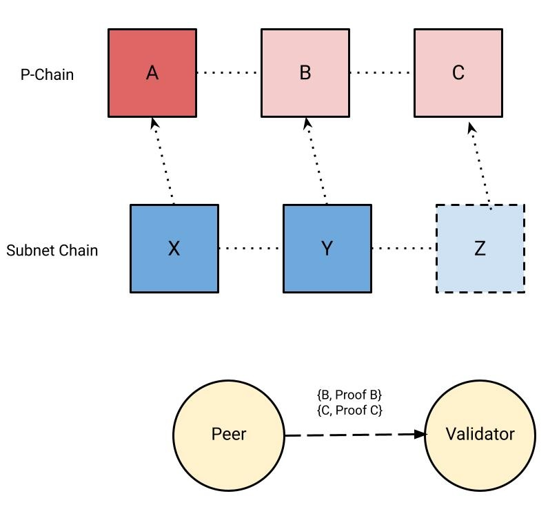
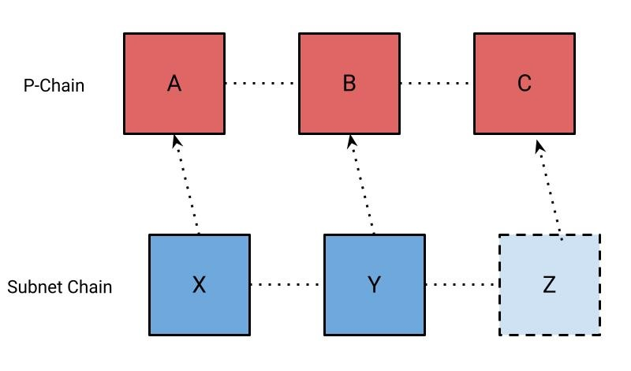

```text
ACP: 75
Title: Acceptance Proofs
Author(s): Joshua Kim
Discussions-To: https://github.com/avalanche-foundation/ACPs/discussions/76
Status: Proposed
Track: Standards
```

## Abstract

Introduces support for a proof of a block’s acceptance in consensus.

## Motivation

Subnets use the [ProposerVM](https://github.com/ava-labs/avalanchego/blob/416fbdf1f783c40f21e7009a9f06d192e69ba9b5/vms/proposervm/README.md) to implement a soft leader mechanism. The ProposerVM determines the block producer schedule from a randomly shuffled validator set for that subnet at each block height. The ProposerVM wrapper specifies the P-Chain height where it was verified.

If a ProposerVM header specifies a P-Chain height that is not accepted from the node's perspective, then the block is treated as invalid until the P-Chain height advances.

If many nodes disagree about the current tip of the P-Chain, it can lead to a liveness failure where a subnet is not able to produce any blocks because nodes might have copies of the P-Chain that are out-of-sync with each other. In practice, this almost never happens because nodes produce blocks with a P-Chain height in the past, using a few blocks as a buffer since it’s likely that most nodes would have accepted an old block. This however, relies on an assumption that validators are constantly making progress in consensus to prevent the subnet from potentially stalling. This leaves an open concern where the P-Chain stalling on a node would prevent it from verifying any blocks, leading to a subnet potentially unable to produce blocks if many validators stalled at different heights due to a P-Chain outage.

---

Figure 1: A Validator that has synced P-Chain blocks `A` and `B` fails verification of a block proposed at block `C`.


---

We introduce "acceptance proofs" and add them to the ProposerVM header, so that a peer can verify any correctly produced block by verifying the corresponding P-Chain acceptance proofs. If a block’s proof is valid, the blocks can be executed in-order locally to verify the proposed subnet block. Peers can request blocks without explicitly communicating with a validator and verify them without running consensus locally. This has the added benefit of reducing the number of required connections and p2p message load served by P-Chain validators.

---

Figure 2: A Validator is verifying a subnet’s block `Z` which references an unknown P-Chain block `C` in its block header


Figure 3: A Validator requests the blocks and proofs for `B` and `C` from a peer



Figure 4: The Validator accepts the P-Chain blocks and is now able to verify `Z`



---

## Specification

Note: The following is pseudocode.

### ProposerVM

The block header will include a proof-of-acceptance of the parent block which is
a [Warp signature](https://github.com/ava-labs/avalanchego/blob/master/vms/platformvm/warp/README.md#awm-serialization) of the parent block id.

```diff
type BlockHeader struct {
    PChainHeight    uint64
    Timestamp       time.Time
    Proposer        ids.NodeID
+   AcceptanceProof warp.BitSetSignature
  }
```

### P2P

#### Bootstrap

```diff
message Ancestors {
    bytes chain_id = 1;
    uint32 request_id = 2;
-   bytes containers = 3;
+   reserved bytes containers = 3;
+   repeated Container containers = 4;
}
```

The `Ancestors` message is replaced with the `containers`
field which will supply a set of containers with their corresponding proofs.

```diff
+ message Container {
+   bytes container = 1;
+   bytes warp_signature = 2;
+ }
```

The `Container` message is used to send a container with its corresponding
acceptance proof.

#### Aggregation

```diff
+ message GetAcceptanceSignatureRequest {
+   bytes block_id = 1;
+ }
```

The `GetAcceptanceSignatureRequest` message is sent to a peer to request their signature for a given block id.

```diff
+ message GetAcceptanceSignatureResponse {
+   bytes bls_signature = 1;
+ }
```

`GetAcceptanceSignatureResponse` is sent to a peer as a response for `GetAcceptanceSignatureRequest`. `bls_signature` is the peer’s signature using their registered primary network BLS staking key over the requested `block_id`. An empty `bls_signature` field indicates that the block was not accepted yet.

#### Gossip
```diff
+ message GetAcceptanceProofRequest {
+   bytes block_id = 1;
+ }
```

`GetAcceptanceProofRequest` requests an acceptance proof for `block_id` from a peer.

```diff
+ message GetAcceptanceProofResponse {
+   bytes acceptance_proof = 1;
+ }
```

`GetAcceptanceProofResponse` is sent in response to a `GetAcceptanceProofRequest` message. `acceptance_proof` is a Warp Message with Hash payload that contains a hash field of the requested block id. An empty `acceptance_proof` field indicates that the peer does not have the requested acceptance proof.

```diff
+ message AcceptanceProofGossip {
+   bytes acceptance_proof = 1;
+ }
```

`AcceptanceProofGossip` is sent once an aggregate signature has been generated. `acceptance_proof` is a Warp Message with Hash payload that contains a hash field of the corresponding block id. `acceptance_proof` must be non-empty.

### Signature Aggregation

#### Summary

The signature aggregation protocol uses soft-leader election to elect a signature aggregator, and uses a push-pull gossip protocol to disseminate the aggregated signature.

#### Arguments

`h`: Block height

#### Parameters

`d`: Duration of each leader slot: `5 seconds`
`m`: maximum amount of leader slots: `6`
`f` : Safety threshold (proportion of stake): `2/3`
`g`: Initial push gossip size: `20`

##### Aggregation

1. Sort validators at `h` in ascending order by their node ids.
2. Use `h` as a random seed for a MT19937_64 pseudo-random number generator.
3. `m` validators are pseudo-randomly sampled from the sorted validator set, using the pseudo-random number generator to create the leader schedule.
4. Each validator at index `i` in the leader schedule must wait until `i * d` time elapses before it is elected a leader.
5. After `m * d` time elapses, all nodes are elected to become leaders.

When elected, a leader aggregates messages by sending out `GetAcceptanceSignatureRequest` messages to request a signature for block `h` and aggregating the responses. Once a proportion of `f` signers have signed the block the proof is complete and the leader sends an `AcceptanceProofGossip` message to `g` arbitrary validators and completes aggregation.

##### Gossip

Nodes request acceptance proofs for `h` by periodically sending `GetAcceptanceProofRequests` to random validators. Upon receiving a `GetAcceptanceProofResponse`, the signature is verified and accepted if it satisfies `f`.


## Security Considerations

Nodes that bootstrap using state sync may not have the entire history of the
P-Chain and therefore will not be able to provide the entire history for a block
that is referenced in a block that they propose. This would be needed to unblock a node that is attempting to fast-forward their P-Chain, as they require the entire ancestry between their current accepted tip and the block they are attempting to forward to. It is assumed that nodes will have some minimum amount of recent state so that the requester can eventually be unblocked by retrying, as only one node with the requested ancestry is required to unblock the requester.

An alternative is to make a churn assumption and validate the proposed block's proof with a stale validator set to avoid complexity, but this introduces more security concerns.

## Open Questions

* How frequently should signatures be generated?

## Copyright

Copyright and related rights waived via [CC0](https://creativecommons.org/publicdomain/zero/1.0/).
