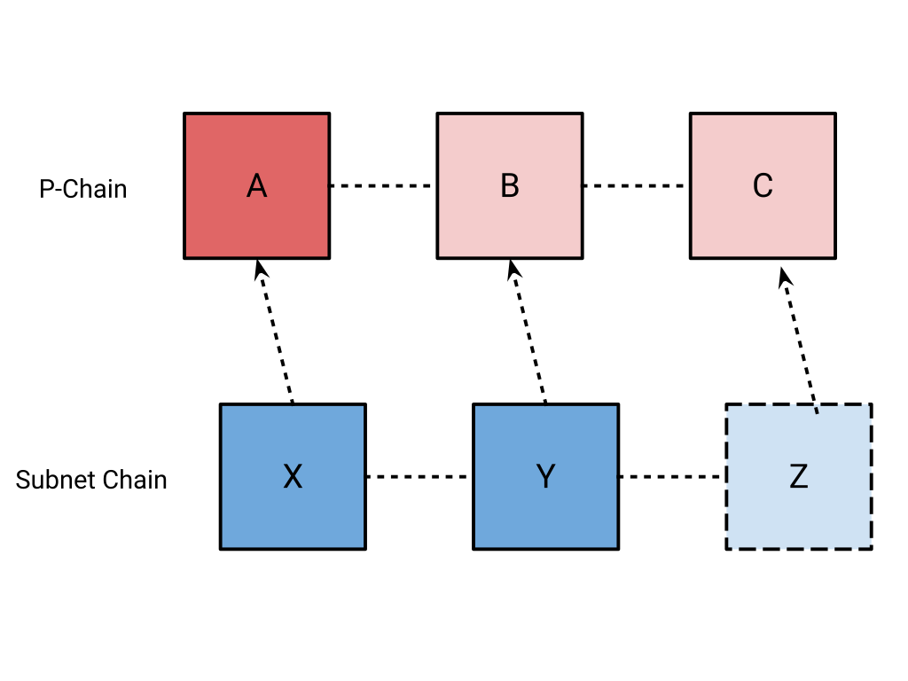
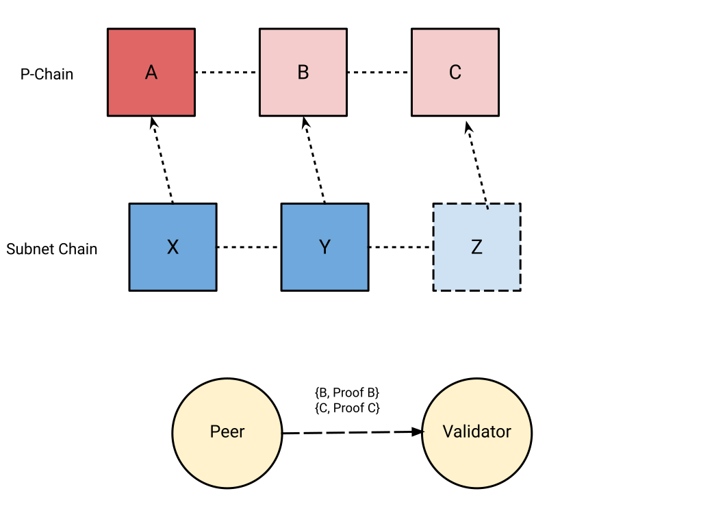
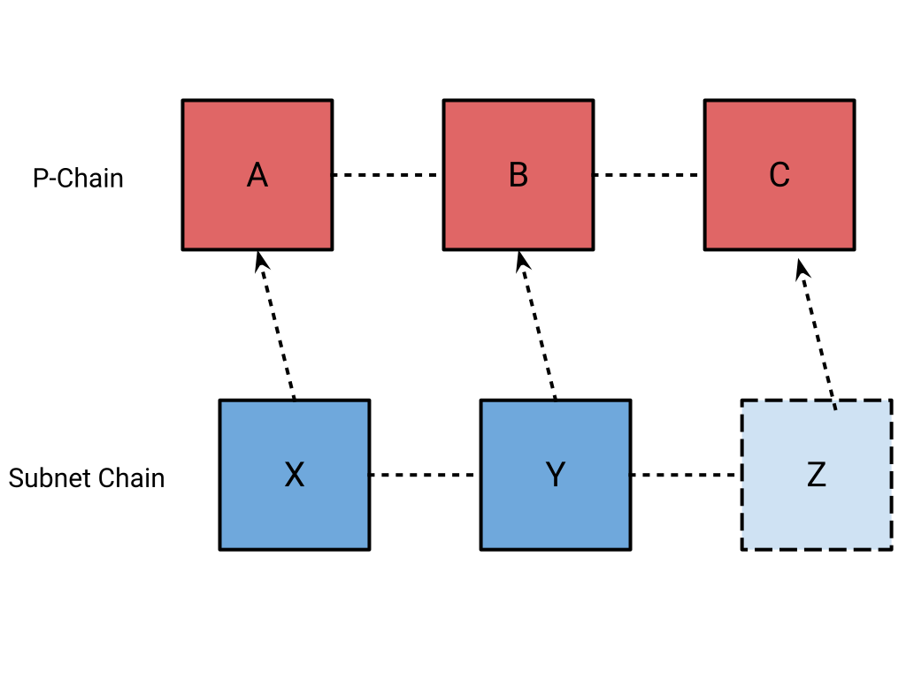

```text
ACP: 75
Title: Consensus Proofs
Author(s): <a list of the author's name(s) and optionally contact info: Joshua Kim
Discussions-To: https://github.com/avalanche-foundation/ACPs/discussions/76
Status: Proposed
Track: Standards
```

This is the suggested template for new ACPs.

## Abstract

Introduces support for a proof of a block’s acceptance in consensus.

## Motivation

Subnets use the ProposerVM to determine the block producer for the next block in the chain through soft-leader election. ProposerVM determines the block producer schedule from a randomly shuffled validator set for that subnet at each block height.  Each block proposed by an elected block producer contains the height of the P-Chain parent block it should be verified at, so that other verifying validators can verify that the block was produced at a valid time.

One key invariant is that nodes cannot verify a block that was produced at a P-Chain height that they have not heard of yet. Verifiers assume that a block height that is beyond the P-Chain height that they have accepted is invalid because that block does not exist yet from the verifier’s perspective.

If many nodes disagree about the current tip of the P-Chain, it can lead to a liveness failure where a subnet is not able to produce any blocks because nodes might have copies of the P-Chain that are out-of-sync with each other. In practice, this almost never happens because nodes produce blocks with a P-Chain height in the past, using a few blocks as a buffer since it’s likely that most nodes would have accepted an old block. This however, relies on an assumption that validators are constantly making progress in consensus to prevent the subnet from potentially stalling. This leaves an open concern where the P-Chain stalling on a node would prevent it from verifying any blocks, leading to a subnet potentially unable to produce blocks if many validators stalled at different heights due to a P-Chain outage.

If ProposerVM blocks were produced with a proof of the P-Chain block to be verified against instead of just its height, verifiers could continue making progress by requesting any block they had not accepted yet from another peer and verifying their corresponding acceptance proofs. If a block’s proof is valid, the blocks can be executed in-order locally to finally verify the proposed subnet block.


Figure 1: A Validator is verifying a subnet’s block `Z` which references an unknown P-Chain block `C` in its block header


Figure 2: A Validator requests the blocks and proofs for `B` and `C` from a peer


Figure 3: The Validator accepts the P-Chain blocks and is now able to verify `Z`

## Specification

Note: The following is pseudocode and is provided only as visual aid.

### ProposerVM

The block header will require an update to include a Proof of the parent block
to be verified at corresponding to the existing height field.

```diff
type BlockHeader struct {
    PChainHeight uint64
    Timestamp    time.Time
    Proposer     ids.NodeID
+   Proof        []byte
  }
```

### P2P

The `Ancestors` message is replaced with the `containers`
field which will supply a set of containers with their corresponding proofs.

```diff
message Ancestors {
    bytes chain_id = 1;
    uint32 request_id = 2;
-   repeated bytes containers = 3;
+   repeated Container containers = 4;
}
```

The `Container` message is used to send a container with its corresponding
consensus proof.

```diff
message Container {
    bytes container = 1;
    bytes proof = 2;
}
```

## Security Considerations

Nodes that bootstrap using state sync may not have the entire history of the
P-Chain and therefore will not be able to provide the entire history for a block
that referenced in a block they propose. This would be needed to unblock a node that is attempting to fast-forward their P-Chain, as they require the entire ancestry between their current accepted tip and the block they are attempting to forward to. This is considered to be acceptable as
nodes will be expected to maintain some minimum of some recent state. An alternative is to make a churn assumption and validate the proposed block's proof with a stale validator set.

## Copyright

Copyright and related rights waived via [CC0](https://creativecommons.org/publicdomain/zero/1.0/).
