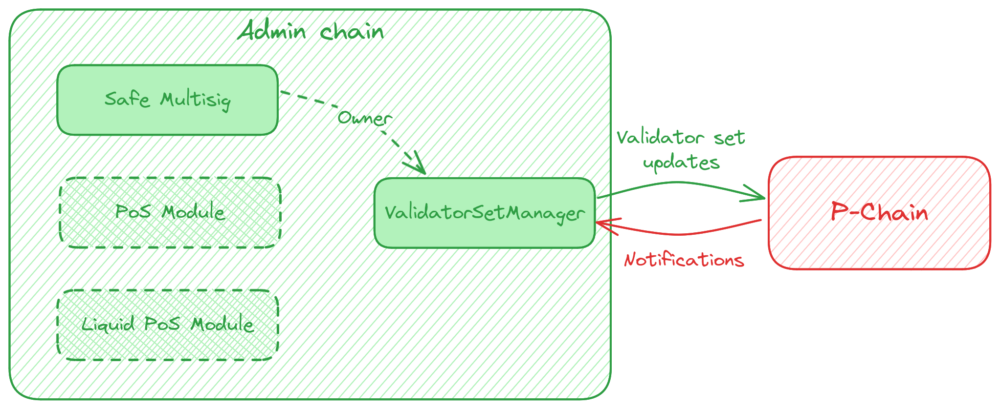

```text
ACP: 99
Title: ValidatorSetManager Solidity Contract
Author(s): Gauthier Leonard <https://github.com/Nuttymoon>
Discussions-To: https://github.com/avalanche-foundation/ACPs/discussions/98
Status: Proposed
Track: Best Practices
Dependencies: 77
```

## Abstract

Define (i) a reference implementation for a minimal Solidity smart contract to manage a Subnet’s validator set from an Avalanche EVM chain, as well as (ii) a reference architecture to easily plug in custom “security modules” on top of this contract (e.g. to implement a PoS Subnet).

The proposed name for this contract is `ValidatorSetManager`.

This proposal should also help define the payload of the P-Chain notifications sent to the Subnet upon validator addition, weight change and removal.

This ACP relies on concepts introduced in [ACP-77 (Reinventing Subnets)](https://github.com/avalanche-foundation/ACPs/tree/main/ACPs/77-reinventing-subnets). It depends on it to be marked as `Implementable`.

## Motivation

[ACP-77 (Reinventing Subnets)](https://github.com/avalanche-foundation/ACPs/tree/main/ACPs/77-reinventing-subnets) opens the door to managing a Subnet validator set (stored on the P-Chain) from any chain on the Avalanche Network. The P-Chain allows a Subnet to specify a Warp Derived Address as the validator set manager. The `(blockchainID, address)` pair specified by the Warp Derived Address is responsible for sending Warp `AddressedCall` payloads to issue `RegisterSubnetValidatorTx` and `SetSubnetValidatorWeightTx` on the P-Chain. This enables an onchain program add, modify the weight of, and remove validators.

On each validator set change, the P-Chain generates a Warp message to notify any onchain program tracking the validator set. Onchain programs must be able to interpret this message, so they can trigger the appropriate action. These notification messages have not been specified to date.

Given these assumptions and the fact that most of the active blockchains on Avalanche mainnet are EVM-based (especially the C-Chain, on which we can expect most of the Subnet “validator manager” addresses will be hosted for security reasons), we propose defining a reference implementation for a Solidity smart contract that can:

1. Hold relevant information about the current Subnet validator set, as well as historical information
2. Send validator set updates by issuing transactions defined in ACP-77 to the P-Chain
3. Correctly update the validator set by interpreting notification messages received from the P-Chain
4. Be easily extended with custom “security modules” to implement any security model

Having an audited and open-source reference implementation freely available will contribute to lowering the cost of launching Subnets on Avalanche.

Once deployed, this contract will be used as the `address` in the `SetSubnetValidatorManagerTx`.

## Specification

### Storage

The `ValidatorSetManager` needs to store all this data to operate correctly.

**Note:** This is pseudo-code that might not be 100% syntactically correct.

```solidity
// The ID of the Subnet that uses this contract to manage its validator set
bytes32 subnetID;

// The current Subnet validator set (list of NodeIDs)
bytes32[] subnetCurrentValidatorSet;

// Subnet validator
struct SubnetValidator {
    // The Warp message ID corresponding to the RegisterSubnetValidatorTx that added the validator.
    // The message ID is needed to submit subsequent SetSubnetValidatorWeightTx.
    bytes32 messageID,
    // The nonce of the latest validator weight update
    uint64 nonce,
    // The validator weight
    uint64 weight,
    // The timestamp the validator was added
    uint64 addTimestamp
}

// The Subnet current validators
// NodeID => SubnetValidator
mapping(bytes32 => SubnetValidator) subnetCurrentValidators;

// The total weight of the current Subnet validator set
uint64 subnetTotalWeight;

// Subnet validator pending registration
struct SubnetRegisteringValidator {
    // The validator weight
    uint64 weight,
    // The timestamp after which the signature is invalid
    uint64 expiry,
    // The Ed25519 signature over the concatenated bytes of [subnetID]+[nodeID]+[blsPublicKey]+[weight]+[balance]+[expiry]
    bytes signature
}

// The Subnet validators that are pending registration (= waiting for addition notification from the P-Chain)
// NodeID => registering validator
mapping(bytes32 => SubnetRegisteringValidator) subnetRegisteringValidators;

// Subnet validation status
enum SubnetValidationStatus {
    Registering,
    Active,
    Removing,
    Over
}

// Subnet validation
struct SubnetValidation {
    // The validation status
    SubnetValidationStatus status,
    // The list of validation periods
    // The index is the nonce associated with the weight update.
    SubnetValidationPeriod[] periods,
    // The nonce of the current validation period
    uint64 currentValidationPeriod
}

// Subnet validation period
struct SubnetValidationPeriod {
    // The weight of the validator during the period
    uint64 weight,
    // The start time of the validation period
    uint64 startTime,
    // The end time of the validation period (only ≠ 0 when the period is over)
    uint64 endTime,
    // The uptime of the validator during this validation period (only ≠ 0 once the validation period is over)
    uint64 uptime
}

/**
 * The list of message IDs associated with a validator of the Subnet
 * Each message ID corresponds to a RegisterSubnetValidatorTx
 * NodeID => messageID[]
 */
mapping(bytes32 => bytes32[]) subnetValidatorMessages;
// The validation corresponding to each message ID (= RegisterSubnetValidatorTx)
// messageID => SubnetValidation
mapping(bytes32 => SubnetValidation) subnetValidations;
```

#### About `validation`s

A `validation` represents the continuous time frame during which a node is part of the validator set and can be composed of multiple periods. A new period starts every time the validator weight changes during the same validation.

Each validation is identified by the `MessageID` corresponding to the Warp message in the `RegisterSubnetValidatorTx` that added the validator.

`subnetValidations` will allow custom “security modules” (e.g. a PoS module) to take appropriate action upon node operator interactions (e.g. rewarding the node operator upon unstake). The `SubnetValidationPeriod` list will enable proper reconstruction of the validation timeline for each validator.

### External functions

The `ValidatorSetManager` contract should implement the following `external` functions.

**Note:** This is pseudo-code that might not be 100% syntactically correct.

```solidity
// Returns the ID of the Subnet tied to this contract
function getSubnetID() external view returns (bytes32);

// Returns a Subnet validator information by its NodeID
function getSubnetValidator(bytes32 nodeID) external view returns (SubnetValidator);

/**
 * Used to issue a RegisterSubnetValidatorTx
 * @param nodeID The ID of the node to add to the Subnet
 * @param weight The weight of the node on the Subnet
 * @param expiry The time after which this message is invalid
 * @param signature The Ed25519 signature of [subnetID]+[nodeID]+[blsPublicKey]+[weight]+[timestamp]
 */
function registerSubnetValidator(
    bytes32 nodeID,
    uint64 weight,
    uint64 expiry,
    bytes signature
) external onlyOwner;

/**
 * Used to issue a SetSubnetValidatorWeightTx
 * @param nodeID The ID of the node to modify
 * @param weight The new weight of the node on the Subnet
 */
function setSubnetValidatorWeight(
    bytes32 nodeID,
    uint64 weight
) external onlyOwner;

/**
 * Called to update the Subnet validator set upon receiving a notification Warp message from the P-Chain
 * (after the successful addition or removal of a validator)
 * @param messageIndex The index of the Warp message from the P-Chain
 */
function updateSubnetValidatorSet(
    uint32 messageIndex
) external;
```

#### About `ExitValidatorSetTx`

This transaction allows a validator to exit a Subnet validator set directly from the P-Chain to prevent the Subnet from locking validators into participating in consensus indefinitely. Therefore it is not meant to be called in the `ValidatorSetManager` contract.

### Information Needed from the P-Chain

Upon successful addition, weight update, and removal of a validator from the Subnet, the P-Chain will send a notification in the form of a Warp message. The `updateSubnetValidatorSet` function is responsible for deserializing this message and updating the contract state accordingly.

To update the validator set, the P-Chain needs to send a notification with the following payload:

```
+-----------+----------+-----------+
|  subnetID : [32]byte |  32 bytes |
+-----------+----------+-----------+
|    nodeID : [32]byte |  32 bytes |
+-----------+----------+-----------+
| messageID : [32]byte |  32 bytes |
+-----------+----------+-----------+
|     nonce :   uint64 |   8 bytes |
+-----------+----------+-----------+
|    weight :   uint64 |   8 bytes |
+-----------+----------+-----------+
| timestamp :   uint64 |   8 bytes |
+-----------+----------+-----------+
|    uptime : [64]byte |  64 bytes |
+-----------+----------+-----------+
                       | 184 bytes |
                       +-----------+
```

- The Subnet ID
- The NodeID
- The `MessageID` corresponding to the Warp message in the `RegisterSubnetValidatorTx` that added the validator (SHA256)
- The `nonce` corresponding to this update
- The weight of the validator (if `0`, this means that the validation is over)
- The exact timestamp at which the weight was updated (if the nonce is `0`, this also means the beginning of the `validation`)
- The uptime observed during the previous validation period (only useful in case a validator weight update)

Note that the timestamp can also be used to update the `endTime` of the previous validation period.

**Note:** Once this discussion/ACP is in an advanced stage, an update to ACP-77 can be made to specify the payload of P-Chain notifications.

### Reference Architecture for Custom “Security Modules”

The `ValidatorSetManager` contract will be ownable (e.g. using [OpenZeppelin Ownable](https://docs.openzeppelin.com/contracts/5.x/api/access#Ownable)). The ownership can be transferred to a smart contract, the “Security Module”, that will implement the security rules for the Subnet.



The most simple architecture to implement a PoA Subnet would be to use a [Safe Multisig (or Smart Account)](https://docs.safe.global/advanced/smart-account-overview) as owner, effectively reproducing the existing Subnet management functionalities available on the P-Chain today.

Other “Security Modules” could implement PoS, Liquid PoS, etc. The specification of such smart contracts is out of the scope of this ACP.

## Backwards Compatibility

The `ValidatorSetManager` is only a reference implementation, it doesn’t have any impact on the current behavior of the protocol.

## Reference Implementation

A full reference implementation has not been provided yet. It will be provided once this ACP is considered `Implementable`.

## Security Considerations

The audit process of the `ValidatorSetManager` contract is of the utmost importance for the future of the Avalanche ecosystem as most Subnets would rely upon it to secure their Subnet.

## Open Questions

### Should the Subnet validators’ uptime be tracked on the P-Chain?

Given the direction taken by the Avalanche protocol by the introduction of SOVs (Subnet Only Validators), is it the job of the P-Chain to track Subnet validators’ uptime? If yes, the induced load should be taken into account to compute the continuous fee discussed in ACP-77.

### How could we name “Security Modules”?

I don’t really like this name but cannot come up with anything else.

## Acknowledgments

Special thanks to @leopaul36 and @aaronbuchwald for their review before publication!

## Copyright

Copyright and related rights waived via [CC0](https://creativecommons.org/publicdomain/zero/1.0/).
