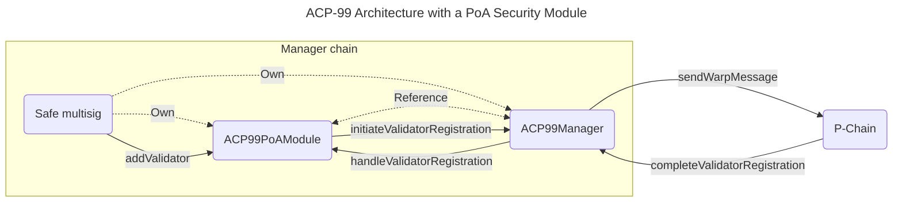

| ACP          | 99                                                                                   |
| :----------- | :----------------------------------------------------------------------------------- |
| Title        | Validator Manager Solidity Standard                                                  |
| Author(s)    | Gauthier Leonard ([@Nuttymoon](https://github.com/Nuttymoon))                        |
| Status       | Proposed ([Discussion](https://github.com/avalanche-foundation/ACPs/discussions/98)) |
| Track        | Best Practices                                                                       |
| Dependencies | [ACP-77](../77-reinventing-subnets/README.md)                                        |

## Abstract

Define (i) a reference interface for a minimal Validator Manager Solidity smart contract to be deployed on any Avalanche EVM chain, as well as (ii) a modular architecture to easily plug in custom “security modules” on top of this contract (e.g. to implement a PoS Subnet).

This ACP relies on concepts introduced in [ACP-77 (Reinventing Subnets)](https://github.com/avalanche-foundation/ACPs/tree/main/ACPs/77-reinventing-subnets). It depends on it to be marked as `Implementable`.

## Motivation

[ACP-77 (Reinventing Subnets)](https://github.com/avalanche-foundation/ACPs/tree/main/ACPs/77-reinventing-subnets) opens the door to managing an L1 validator set (stored on the P-Chain) from any chain on the Avalanche Network. The P-Chain allows a Subnet to specify a "validator manager". This `(blockchainID, address)` pair is responsible for sending Warp messages contained within `RegisterL1ValidatorTx` and `SetL1ValidatorWeightTx` on the P-Chain. This enables an on-chain program to add, modify the weight of, and remove validators.

On each validator set change, the P-Chain is willing to sign an `AddressedCall` to notify any onchain program tracking the validator set. Onchain programs must be able to interpret this message, so they can trigger the appropriate action. The 2 kinds of `AddressedCall`s [defined in ACP-77](https://github.com/avalanche-foundation/ACPs/tree/main/ACPs/77-reinventing-subnets#p-chain-warp-message-payloads) are `RegisterL1ValidatorMessage` and `L1ValidatorWeightMessage`.

Given these assumptions and the fact that most of the active blockchains on Avalanche mainnet are EVM-based, we propose defining a reference implementation for a Solidity smart contract that can:

1. Hold relevant information about the current Subnet validator set, as well as historical information
2. Send validator set updates to the P-Chain by generating `AdressedCall`s defined in ACP-77
3. Correctly update the validator set by interpreting notification messages received from the P-Chain
4. Be easily extended with custom “security modules” to implement any security model (e.g. PoS). Those modules have to implement the `IACP99SecurityModule` interface and will be called by the `ACP99Manager` contract upon validator set updates.

Having an audited and open-source reference implementation freely available will contribute to lowering the cost of launching Subnets on Avalanche.

Once deployed, the `ACP99Manager` contract will be used as the `Address` in the [`ConvertSubnetToL1Tx`](https://github.com/avalanche-foundation/ACPs/tree/main/ACPs/77-reinventing-subnets#convertsubnettol1tx).

## Specification

**Note:** The naming convention followed for the interfaces and contracts are inspired from the way [OpenZeppelin Contracts](https://docs.openzeppelin.com/contracts/5.x/) are named after ERC standards, using `ACP` instead of `ERC`.

### IACP99Manager

Here is the proposed interface for the `IACP99Manager` contract:

```solidity
interface IACP99Manager {
    /// @notice L1 validation status
    enum ValidationStatus {
        Registering,
        Active,
        Updating,
        Removing,
        Completed,
        Expired
    }

    /**
     * @notice L1 validation
     * @param status The validation status
     * @param nodeID The NodeID of the validator
     * @param startTime The start time of the validation
     * @param endTime The end time of the validation
     * @param periods The list of validation periods.
     * The index is the nonce associated with the weight update.
     * @param activeSeconds The time during which the validator was active during this validation
     * @param uptimeSeconds The uptime of the validator for this validation
     */
    struct Validation {
        ValidationStatus status;
        bytes32 nodeID;
        ValidationPeriod[] periods;
        uint64 activeSeconds;
        uint64 uptimeSeconds;
    }

    /**
     * @notice L1 validation period
     * @param weight The weight of the validator during the period
     * @param startTime The start time of the validation period
     * @param endTime The end time of the validation period (only ≠ 0 when the period is over)
     */
    struct ValidationPeriod {
        uint64 weight;
        uint64 startTime;
        uint64 endTime;
    }

    /// @notice Emitted when the security module address is set
    event SetSecurityModule(address indexed securityModule);
    /// @notice Emitted when an initial validator is registered
    event RegisterInitialValidator(
        bytes32 indexed nodeID, bytes32 indexed validationID, uint64 weight
    );
    /// @notice Emitted when a validator registration to the L1 is initiated
    event InitiateValidatorRegistration(
        bytes32 indexed nodeID,
        bytes32 indexed validationID,
        bytes32 registrationMessageID,
        uint64 registrationExpiry,
        uint64 weight
    );
    /// @notice Emitted when a validator registration to the L1 is completed
    event CompleteValidatorRegistration(
        bytes32 indexed nodeID, bytes32 indexed validationID, uint64 weight
    );
    /// @notice Emitted when a validator weight update is initiated
    event InitiateValidatorWeightUpdate(
        bytes32 indexed nodeID,
        bytes32 indexed validationID,
        bytes32 weightUpdateMessageID,
        uint64 weight
    );
    /// @notice Emitted when a validator weight update is completed
    event CompleteValidatorWeightUpdate(
        bytes32 indexed nodeID, bytes32 indexed validationID, uint64 nonce, uint64 weight
    );

    error ACP99Manager__ValidatorSetAlreadyInitialized();
    error ACP99Manager__InvalidSubnetConversionID(bytes32 conversionID, bytes32 messageConversionID);
    error ACP99Manager__InvalidManagerBlockchainID(
        bytes32 managerBlockchainID, bytes32 conversionBlockchainID
    );
    error ACP99Manager__InvalidManagerAddress(address managerAddress, address conversionAddress);
    error ACP99Manager__ZeroAddressSecurityModule();
    error ACP99Manager__OnlySecurityModule(address sender, address securityModule);
    error ACP99Manager__InvalidExpiry(uint64 expiry, uint256 timestamp);
    error ACP99Manager__ZeroNodeID();
    error ACP99Manager__NodeAlreadyValidator(bytes nodeID);
    error ACP99Manager__InvalidPChainOwnerThreshold(uint256 threshold, uint256 addressesLength);
    error ACP99Manager__PChainOwnerAddressesNotSorted();
    error ACP99Manager__InvalidSignatureLength(uint256 length);
    error ACP99Manager__InvalidValidationID(bytes32 validationID);
    error ACP99Manager__InvalidWarpMessage();
    error ACP99Manager__InvalidSourceChainID(bytes32 sourceChainID);
    error ACP99Manager__InvalidOriginSenderAddress(address originSenderAddress);
    error ACP99Manager__InvalidRegistration();
    error ACP99Manager__NodeIDNotActiveValidator(bytes nodeID);
    error ACP99Manager__InvalidUptimeValidationID(bytes32 validationID);
    error ACP99Manager__InvalidSetL1ValidatorWeightNonce(uint64 nonce, uint64 currentNonce);

    /// @notice Get the ID of the Subnet tied to this manager
    function subnetID() external view returns (bytes32);

    /// @notice Get the address of the security module attached to this manager
    function getSecurityModule() external view returns (address);

    /// @notice Get the validation details for a given validation ID
    function getValidation(
        bytes32 validationID
    ) external view returns (Validation memory);

    /// @notice Get an L1 validator's active validation ID
    function getValidatorActiveValidation(
        bytes memory nodeID
    ) external view returns (bytes32);

    /// @notice Get the current L1 validator set (list of NodeIDs)
    function getActiveValidatorSet() external view returns (bytes32[] memory);

    /// @notice Get the total weight of the current L1 validator set
    function l1TotalWeight() external view returns (uint64);

    /// @notice Get the list of message IDs associated with an L1 validator
    function getValidatorValidations(
        bytes memory nodeID
    ) external view returns (bytes32[] memory);

    /**
     * @notice Set the address of the security module attached to this manager
     * @param securityModule_ The address of the security module
     */
    function setSecurityModule(
        address securityModule_
    ) external;

    /**
     * @notice Verifies and sets the initial validator set for the chain through a P-Chain
     * SubnetToL1ConversionMessage.
     * @param conversionData The Subnet conversion message data used to recompute and verify against the ConversionID.
     * @param messsageIndex The index that contains the SubnetToL1ConversionMessage Warp message containing the ConversionID to be verified against the provided {conversionData}
     */
    function initializeValidatorSet(
        ConversionData calldata conversionData,
        uint32 messsageIndex
    ) external;

    /**
     * @notice Initiate a validator registration by issuing a RegisterL1ValidatorTx Warp message
     * @param nodeID The ID of the node to add to the L1
     * @param blsPublicKey The BLS public key of the validator
     * @param registrationExpiry The time after which this message is invalid
     * @param remainingBalanceOwner The remaining balance owner of the validator
     * @param disableOwner The disable owner of the validator
     * @param weight The weight of the node on the L1
     */
    function initiateValidatorRegistration(
        bytes memory nodeID,
        bytes memory blsPublicKey,
        uint64 registrationExpiry,
        PChainOwner memory remainingBalanceOwner,
        PChainOwner memory disableOwner,
        uint64 weight
    ) external returns (bytes32);

    /**
     * @notice Resubmits a validator registration message to be sent to P-Chain.
     * Only necessary if the original message can't be delivered due to validator churn.
     * @param validationID The validationID attached to the registration message
     */
    function resendValidatorRegistrationMessage(
        bytes32 validationID
    ) external returns (bytes32);

    /**
     * @notice Completes the validator registration process by returning an acknowledgement of the registration of a
     * validationID from the P-Chain.
     * @param messageIndex The index of the Warp message to be received providing the acknowledgement.
     */
    function completeValidatorRegistration(
        uint32 messageIndex
    ) external;

    /**
     * @notice Initiate a validator weight update by issuing a SetL1ValidatorWeightTx Warp message.
     * If the weight is 0, this initiates the removal of the validator from the L1. An uptime proof can be
     * included. This proof might be required to claim validator rewards (handled by the security module).
     * @param nodeID The ID of the node to modify
     * @param weight The new weight of the node on the L1
     * @param includesUptimeProof Whether the uptime proof is included in the message
     * @param messageIndex The index of the Warp message containing the uptime proof
     */
    function initiateValidatorWeightUpdate(
        bytes memory nodeID,
        uint64 weight,
        bool includesUptimeProof,
        uint32 messageIndex
    ) external;

    /**
     * @notice Completes the validator weight update process by returning an acknowledgement of the weight update of a
     * validationID from the P-Chain.
     * @param messageIndex The index of the Warp message to be received providing the acknowledgement.
     */
    function completeValidatorWeightUpdate(
        uint32 messageIndex
    ) external;
}
```

**Note:** The NodeIDs are stored as `bytes32` in the `ACP99Manager` interface to simplify the implementation.

#### About `Validation`s

A `Validation` represents the continuous time frame during which a node is part of the validator set and can be composed of multiple periods. A new period starts every time the validator weight changes during the same validation.

Each `Validation` is identified by its `validationID` which is the SHA256 of the Payload of the `AddressedCall` in the `RegisterL1ValidatorTx` adding the validator to the Subnet's validator set, as defined in ACP-77.

#### About `DisableL1ValidatorTx`

This transaction allows the `DisableOwner` of a validator to disable it directly from the P-Chain to claim the unspent `Balance` linked to the validation of a failed L1. Therefore it is not meant to be called in the `Manager` contract.

### IACP99SecurityModule

Here is the proposed interface for the `IACP99SecurityModule` contract:

```solidity
interface IACP99SecurityModule {
    /**
     * @notice Information about a validator registration
     * @param nodeID The NodeID of the validator node
     * @param validationID The ValidationID of the validation
     * @param weight The initial weight assigned to the validator
     * @param startTime The timestamp when the validation started
     */
    struct ValidatiorRegistrationInfo {
        bytes32 nodeID;
        bytes32 validationID;
        uint64 weight;
        uint64 startTime;
    }

    /**
     * @notice Information about a validator's uptime
     * @param activeSeconds The total number of seconds the validator was active
     * @param uptimeSeconds The total number of seconds the validator was online
     * @param averageWeight The average weight of the validator during the period
     */
    struct ValidatorUptimeInfo {
        uint64 activeSeconds;
        uint64 uptimeSeconds;
        uint64 averageWeight;
    }

    /**
     * @notice Information about a change in a validator's weight
     * @param nodeID The NodeID of the validator node
     * @param validationID The ValidationID of the validation
     * @param nonce A sequential number to order weight changes
     * @param newWeight The new weight assigned to the validator
     * @param uptime The uptime information for the validator
     */
    struct ValidatorWeightChangeInfo {
        bytes32 nodeID;
        bytes32 validationID;
        uint64 nonce;
        uint64 newWeight;
        ValidatorUptimeInfo uptimeInfo;
    }

    error ACP99SecurityModule__ZeroAddressManager();
    error ACP99SecurityModule__OnlyManager(address sender, address manager);

    /// @notice Get the address of the ACP99Manager contract secured by this module
    function getManagerAddress() external view returns (address);

    /**
     * @notice Handle a validator registration
     * @param validatorInfo The information about the validator
     */
    function handleValidatorRegistration(
        ValidatiorRegistrationInfo memory validatorInfo
    ) external;

    /**
     * @notice Handle a validator weight change
     * @param weightChangeInfo The information about the validator weight change
     */
    function handleValidatorWeightChange(
        ValidatorWeightChangeInfo memory weightChangeInfo
    ) external;
}
```

### Reference Architecture

Each `ACP99Manager` contract will be associated with one "security module" that must implement the `IACP99SecurityModule` interface and is the only contract allowed to call the `ACP99Manager` functions related to validator set changes (`initiateValidatorRegistration`, and `initiateValidatorWeightUpdate`). Everytime a validator is added/removed or a weight change is initiated, the `ACP99Manager` will in turn call the corresponding function of the "security module" (`handleValidatorRegistration` or `handleValidatorWeightChange`). We recommend that the "security module" reference an immutable `ACP99Manager` contract address for security reasons.

It is up to the "security module" to decide what action to take when a validator is added/removed or a weight change is confirmed by the P-Chain. Such actions could be starting the withdrawal period and allocating rewards in a PoS Subnet.



"Security modules" could implement PoS, Liquid PoS, etc. The specification of such smart contracts is out of the scope of this ACP.

## Backwards Compatibility

The `IACP99Manager` and `IACP99SecurityModule` interfaces are only a reference interface, they don’t have any impact on the current behavior of the Avalanche protocol.

## Reference Implementation

A work in progress reference implementation is available in the [Suzaku Contracts Library](https://github.com/suzaku-network/suzaku-contracts-library/blob/acp-99-implementation/README.md#acp99-contracts-library) repository. It will be updated until this ACP is considered `Implementable` based on the outcome of the discussion.

## Security Considerations

The audit process of the `ACP99Manager` contract is of the utmost importance for the future of the Avalanche ecosystem as most Subnets would rely upon it to secure their Subnet.

## Open Questions

### Is there an interest to keep historical information about the validator set on the manager chain?

The functions `getValidation` and `getValidatorValidations` would allow to retrieve historical information about the validator set directly from state, notably each validator's performance (uptime) during past validations.
If we don't keep track of the historical information in the `ACP99Manager` contract, this information will still be available in archive nodes and offchain tools (e.g. explorers).

### Should uptime be tracked for each `ValidationPeriod`?

Currently, the `ValidatorUptimeInfo` struct contains the total uptime of a validator during a validation. This means that the uptime is tracked for the entire validation, not for each period.

If we want to track the uptime for each period, we need to figure out how the uptime tracked by the VM can diverge from the validation periods as tracked on the P-Chain. There is indeed a delay between the time the `ValidationPeriod` is ended in the `ACP99Manager` state (validator weight set to `0`) and the time the P-Chain registers the weight update.

### Is an upgradeable architecture more appropriate?

The Teleporter team has been working on its own implementation of a `ValidatorManager` contract in the [teleporter](https://github.com/ava-labs/teleporter/blob/main/contracts/validator-manager/ValidatorManager.sol) repository that is based on abstract and upgradeable contracts.

### Should the `ACP99Manager` include a churn control mechanism?

The Teleporter team implentation of the `ValidatorManager` contract includes a churn control mechanism that prevents too much weight from being added or removed from the validator set in a short amount of time.

### How could we name “Security Modules”?

I don’t really like this name but cannot come up with anything else.

## Acknowledgments

Special thanks to @leopaul36, @aaronbuchwald, @dhrubabasu, @minghinmatthewlam and @michaelkaplan13 for their reviews of previous versions of this ACP!

## Copyright

Copyright and related rights waived via [CC0](https://creativecommons.org/publicdomain/zero/1.0/).
