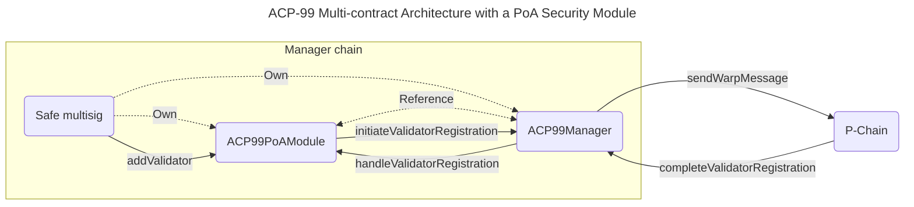
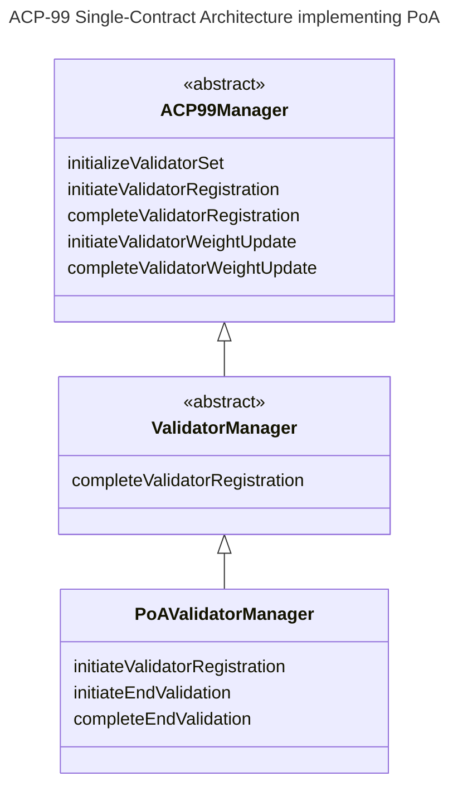

| ACP          | 99                                                                                   |
| :----------- | :----------------------------------------------------------------------------------- |
| Title        | Validator Manager Solidity Standard                                                  |
| Author(s)    | Gauthier Leonard ([@Nuttymoon](https://github.com/Nuttymoon))                        |
| Status       | Proposed ([Discussion](https://github.com/avalanche-foundation/ACPs/discussions/165)) |
| Track        | Best Practices                                                                       |
| Dependencies | [ACP-77](../77-reinventing-subnets/README.md)                                        |

## Abstract

Define a standard Validator Manager Solidity smart contract to be deployed on any Avalanche EVM chain.

This ACP relies on concepts introduced in [ACP-77 (Reinventing Subnets)](https://github.com/avalanche-foundation/ACPs/tree/main/ACPs/77-reinventing-subnets). It depends on it to be marked as `Implementable`.

## Motivation

[ACP-77 (Reinventing Subnets)](https://github.com/avalanche-foundation/ACPs/tree/main/ACPs/77-reinventing-subnets) opens the door to managing an L1 validator set (stored on the P-Chain) from any chain on the Avalanche Network. The P-Chain allows a Subnet to specify a "validator manager" if it is converted to an L1 using `ConvertSubnetToL1Tx`. This `(blockchainID, address)` pair is responsible for sending ICM messages contained within `RegisterL1ValidatorTx` and `SetL1ValidatorWeightTx` on the P-Chain. This enables an on-chain program to add, modify the weight of, and remove validators.

On each validator set change, the P-Chain is willing to sign an `AddressedCall` to notify any on-chain program tracking the validator set. On-chain programs must be able to interpret this message, so they can trigger the appropriate action. The 2 kinds of `AddressedCall`s [defined in ACP-77](https://github.com/avalanche-foundation/ACPs/tree/main/ACPs/77-reinventing-subnets#p-chain-warp-message-payloads) are `L1ValidatorRegistrationMessage` and `L1ValidatorWeightMessage`.

Given these assumptions and the fact that most of the active blockchains on Avalanche Mainnet are EVM-based, we propose `ACP99Manager` as the standard Solidity contract specification that can:

1. Hold relevant information about the current L1 validator set
2. Send validator set updates to the P-Chain by generating `AdressedCall`s defined in ACP-77
3. Correctly update the validator set by interpreting notification messages received from the P-Chain
4. Be easily integrated into validator manager implementations that utilize various security models (e.g. Proof-of-Stake).

Having an audited and open-source reference implementation freely available will contribute to lowering the cost of launching L1s on Avalanche.

Once deployed, the `ACP99Manager` implementation contract can be used as the `Address` in the [`ConvertSubnetToL1Tx`](https://github.com/avalanche-foundation/ACPs/tree/main/ACPs/77-reinventing-subnets#convertsubnettol1tx).

## Specification

> **Note:**: The naming convention followed for the interfaces and contracts are inspired from the way [OpenZeppelin Contracts](https://docs.openzeppelin.com/contracts/5.x/) are named after ERC standards, using `ACP` instead of `ERC`.


### Type Definitions

The following type definitions are used in the function signatures described in [Contract Specification](#contract-specification)

```solidity
/**
 * @notice Description of the conversion data used to convert
 * a subnet to an L1 on the P-Chain.
 * This data is the pre-image of a hash that is authenticated by the P-Chain
 * and verified by the Validator Manager.
 */
struct ConversionData {
    bytes32 subnetID;
    bytes32 validatorManagerBlockchainID;
    address validatorManagerAddress;
    InitialValidator[] initialValidators;
}

/// @notice Specifies an initial validator, used in the conversion data.
struct InitialValidator {
    bytes nodeID;
    bytes blsPublicKey;
    uint64 weight;
}

/// @notice L1 validator status.
enum ValidatorStatus {
    Unknown,
    PendingAdded,
    Active,
    PendingRemoved,
    Completed,
    Invalidated
}

/**
 * @notice Specifies the owner of a validator's remaining balance or disable owner on the P-Chain.
 * P-Chain addresses are also 20-bytes, so we use the address type to represent them.
 */
struct PChainOwner {
    uint32 threshold;
    address[] addresses;
}

/**
 * @notice Contains the active state of a Validator.
 * @param status The validator status.
 * @param nodeID The NodeID of the validator.
 * @param startingWeight The weight of the validator at the time of registration.
 * @param sentNonce The current weight update nonce sent by the manager.
 * @param receivedNonce The highest nonce received from the P-Chain.
 * @param weight The current weight of the validator.
 * @param startTime The start time of the validator.
 * @param endTime The end time of the validator.
 */
struct Validator {
    ValidatorStatus status;
    bytes nodeID;
    uint64 startingWeight;
    uint64 sentNonce;
    uint64 receivedNonce;
    uint64 weight;
    uint64 startTime;
    uint64 endTime;
}
```

#### About `Validator`s

A `Validator` represents the continuous time frame during which a node is part of the validator set.

Each `Validator` is identified by its `validationID`. If a validator was added as part of the initial set of continuous dynamic fee paying validators, its `validationID` is the SHA256 hash of the 36 bytes resulting from concatenating the 32 byte `ConvertSubnetToL1Tx` transaction ID and the 4 byte index of the initial validator within the transaction. If a validator was added to the L1's validator set post-conversion, its `validationID` is the SHA256 of the payload of the `AddressedCall` in the `RegisterL1ValidatorTx` used to add it, as defined in ACP-77.

### Contract Specification

The following abstract contract describes the standard `ACP99Manager` functionality. 

For a full implementation, please see the [Reference Implementation](#reference-implementation)

```solidity
/*
 * @title ACP99Manager
 * @notice The ACP99Manager interface represents the functionality for sovereign L1
 * validator management, as specified in ACP-77.
 */
abstract contract ACP99Manager {
    /// @notice Emitted when an initial validator is registered.
    event RegisteredInitialValidator(bytes32 indexed validationID, bytes20 indexed nodeID, uint64 weight);
    /// @notice Emitted when a validator registration to the L1 is initiated.
    event InitiatedValidatorRegistration(
        bytes32 indexed validationID,
        bytes20 indexed nodeID,
        bytes32 registrationMessageID,
        uint64 registrationExpiry,
        uint64 weight
    );
    /// @notice Emitted when a validator registration to the L1 is completed.
    event CompletedValidatorRegistration(bytes32 indexed validationID, uint64 weight);
    /// @notice Emitted when removal of an L1 validator is initiated.
    event InitiatedValidatorRemoval(
        bytes32 indexed validationID,
        bytes32 validatorWeightMessageID,
        uint64 weight,
        uint64 endTime
    );
    /// @notice Emitted when removal of an L1 validator is completed.
    event CompletedValidatorRemoval(bytes32 indexed validationID);
    /// @notice Emitted when a validator weight update is initiated.
    event InitiatedValidatorWeightUpdate(
        bytes32 indexed validationID, uint64 nonce, bytes32 weightUpdateMessageID, uint64 weight
    );
    /// @notice Emitted when a validator weight update is completed.
    event CompletedValidatorWeightUpdate(bytes32 indexed validationID, uint64 nonce, uint64 weight);

    /// @notice Returns the SubnetID of the L1 tied to this manager
    function subnetID() public view virtual returns (bytes32 id);

    /// @notice Returns the validator details for a given validation ID.
    function getValidator(bytes32 validationID)
        public
        view
        virtual
        returns (Validator memory validator);

    /// @notice Returns the total weight of the current L1 validator set.
    function l1TotalWeight() public view virtual returns (uint64 weight);

    /**
     * @notice Verifies and sets the initial validator set for the chain by consuming a
     * SubnetToL1ConversionMessage from the P-Chain.
     *
     * Emits a {RegisteredInitialValidator} event for each initial validator in {conversionData}.
     *
     * @param conversionData The Subnet conversion message data used to recompute and verify against the ConversionID.
     * @param messsageIndex The index that contains the SubnetToL1ConversionMessage ICM message containing the
     * ConversionID to be verified against the provided {conversionData}.
     */
    function initializeValidatorSet(
        ConversionData calldata conversionData,
        uint32 messsageIndex
    ) public virtual;

    /**
     * @notice Initiates validator registration by issuing a RegisterL1ValidatorMessage. The validator should
     * not be considered active until completeValidatorRegistration is called.
     *
     * Emits an {InitiatedValidatorRegistration} event on success.
     *
     * @param nodeID The ID of the node to add to the L1.
     * @param blsPublicKey The BLS public key of the validator.
     * @param registrationExpiry The time after which this message is invalid.
     * @param remainingBalanceOwner The remaining balance owner of the validator.
     * @param disableOwner The disable owner of the validator.
     * @param weight The weight of the node on the L1.
     * @return validationID The ID of the registered validator.
     */
    function _initiateValidatorRegistration(
        bytes memory nodeID,
        bytes memory blsPublicKey,
        uint64 registrationExpiry,
        PChainOwner memory remainingBalanceOwner,
        PChainOwner memory disableOwner,
        uint64 weight
    ) internal virtual returns (bytes32 validationID);

    /**
     * @notice Completes the validator registration process by returning an acknowledgement of the registration of a
     * validationID from the P-Chain. The validator should not be considered active until this method is successfully called.
     *
     * Emits a {CompletedValidatorRegistration} event on success.
     *
     * @param messageIndex The index of the L1ValidatorRegistrationMessage to be received providing the acknowledgement.
     * @return validationID The ID of the registered validator.
     */
    function completeValidatorRegistration(uint32 messageIndex)
        public
        virtual
        returns (bytes32 validationID);

    /**
     * @notice Initiates validator removal by issuing a L1ValidatorWeightMessage with the weight set to zero.
     * The validator should be considered inactive as soon as this function is called.
     *
     * Emits an {InitiatedValidatorRemoval} on success.
     *
     * @param validationID The ID of the validator to remove.
     */
    function _initiateValidatorRemoval(bytes32 validationID) internal virtual;

    /**
     * @notice Completes validator removal by consuming an RegisterL1ValidatorMessage from the P-Chain acknowledging
     * that the validator has been removed.
     *
     * Emits a {CompletedValidatorRemoval} on success.
     *
     * @param messageIndex The index of the RegisterL1ValidatorMessage.
     */
    function completeValidatorRemoval(uint32 messageIndex)
        public
        virtual
        returns (bytes32 validationID);

    /**
     * @notice Initiates a validator weight update by issuing an L1ValidatorWeightMessage with a nonzero weight.
     * The validator weight change should not have any effect until completeValidatorWeightUpdate is successfully called.
     *
     * Emits an {InitiatedValidatorWeightUpdate} event on success.
     *
     * @param validationID The ID of the validator to modify.
     * @param weight The new weight of the validator.
     * @return nonce The validator nonce associated with the weight change.
     * @return messageID The ID of the L1ValidatorWeightMessage used to update the validator's weight.
     */
    function _initiateValidatorWeightUpdate(
        bytes32 validationID,
        uint64 weight
    ) internal virtual returns (uint64 nonce, bytes32 messageID);

    /**
     * @notice Completes the validator weight update process by consuming an L1ValidatorWeightMessage from the P-Chain
     * acknowledging the weight update. The validator weight change should not have any effect until this method is successfully called.
     *
     * Emits a {CompletedValidatorWeightUpdate} event on success.
     *
     * @param messageIndex The index of the L1ValidatorWeightMessage message to be received providing the acknowledgement.
     * @return validationID The ID of the validator, retreived from the L1ValidatorWeightMessage.
     * @return nonce The nonce of the validator, retreived from the L1ValidatorWeightMessage.
     */
    function completeValidatorWeightUpdate(uint32 messageIndex)
        public
        virtual
        returns (bytes32 validationID, uint64 nonce);
}
```

#### Internal Functions

Most of the methods described above are `public`, with the exception of `_initiateValidatorRegistration`, `_initiateValidatorRemoval`, and `_initiateValidatorWeightUpdate`, which are `internal`. This is to account for different semantics of initiating validator set changes, such as checking uptime attested to via ICM message, or transferring funds to be locked as stake. Rather than broaden the definitions of these functions to cover all use cases, we leave it to the implementer to define a suitable external interface and call the appropriate `ACP99Manager` function internally. This is also why this ACP specifies an `abstract contract` rather than an `interface`.

#### Returning Active Validators

While `ACP99Manager` does provide a way to fetch a `Validator` based on its `validationID`, it does not include a method to return all active validators. This is because a `mapping` is a reasonable way to store active validators internally, and Solidity `mapping`s are not iterable. This can be worked around by storing additional indexing metadata in the contract, but not all applications may wish to incur that added complexity.

#### About `DisableL1ValidatorTx`

This transaction allows the `DisableOwner` of a validator to disable it directly from the P-Chain to claim the unspent `Balance` linked to the validator of a failed L1. Therefore it is not meant to be called in the `Manager` contract.

## Backwards Compatibility

`ACP99Manager` is a reference specification. As such, it doesn't have any impact on the current behavior of the Avalanche protocol.

## Reference Implementation

A reference implementation will be provided in Ava Labs' [ICM Contracts](https://github.com/ava-labs/icm-contracts/tree/main/contracts/validator-manager) repository. This reference implementation will need to be updated to conform to `ACP99Manager` before this ACP may be marked `Implementable`.

### Example Integrations

`ACP99Manager` is designed to be easily incorporated into any architecture. Two example integrations are included in this ACP, each of which uses a different architecture.

#### Multi-contract Design

The multi-contract design consists of a contract that implements `ACP99Manager`, and separate "security module" contracts that implement security models, such as PoS or PoA. Each `ACP99Manager` implementation contract is associated with one or more "security modules" that are the only contracts allowed to call the `ACP99Manager` functions that initiate validator set changes (`initiateValidatorRegistration`, and `initiateValidatorWeightUpdate`). Every time a validator is added/removed or a weight change is initiated, the `ACP99Manager` implementation will, in turn, call the corresponding function of the "security module" (`handleValidatorRegistration` or `handleValidatorWeightChange`). We recommend that the "security modules" reference an immutable `ACP99Manager` contract address for security reasons.

It is up to the "security module" to decide what action to take when a validator is added/removed or a weight change is confirmed by the P-Chain. Such actions could be starting the withdrawal period and allocating rewards in a PoS L1.



"Security modules" could implement PoS, Liquid PoS, etc. The specification of such smart contracts is out of the scope of this ACP.

A work in progress implementation is available in the [Suzaku Contracts Library](https://github.com/suzaku-network/suzaku-contracts-library/blob/main/README.md#acp99-contracts-library) repository. It will be updated until this ACP is considered `Implementable` based on the outcome of the discussion.

#### Single-contract Design

The single-contract design consists of a class hierarchy with the base class implementing `ACP99Manager`. The `PoAValidatorManager` child class in the below diagram may be swapped out for another class implementing a different security model, such as PoS. 



This implementation is available in Ava Labs' [ICM Contracts Repository](https://github.com/ava-labs/icm-contracts/tree/main/contracts/validator-manager).

## Security Considerations

The audit process of `ACP99Manager` and reference implementations is of the utmost importance for the future of the Avalanche ecosystem as most L1s would rely upon it to secure their L1.

## Open Questions

### Is there an interest to keep historical information about the validator set on the manager chain?

It is left to the implementor to decide if `getValidator` should return information about historical validators. Information about past validator performance may not be relevant for all applications (e.g. PoA has no need to know about past validator's uptimes). This information will still be available in archive nodes and offchain tools (e.g. explorers), but it is not enforced at the contract level.

### Should `ACP99Manager` include a churn control mechanism?

The Ava Labs [implementation](https://github.com/ava-labs/icm-contracts/blob/main/contracts/validator-manager/ValidatorManager.sol) of the `ValidatorManager` contract includes a churn control mechanism that prevents too much weight from being added or removed from the validator set in a short amount of time. Excessive churn can cause consensus failures, so it may be appropriate to require that churn tracking is implemented in some capacity.

## Acknowledgments

Special thanks to [@leopaul36](https://github.com/leopaul36), [@aaronbuchwald](https://github.com/aaronbuchwald), [@dhrubabasu](https://github.com/dhrubabasu), [@minghinmatthewlam](https://github.com/minghinmatthewlam) and [@michaelkaplan13](https://github.com/michaelkaplan13) for their reviews of previous versions of this ACP!

## Copyright

Copyright and related rights waived via [CC0](https://creativecommons.org/publicdomain/zero/1.0/).
